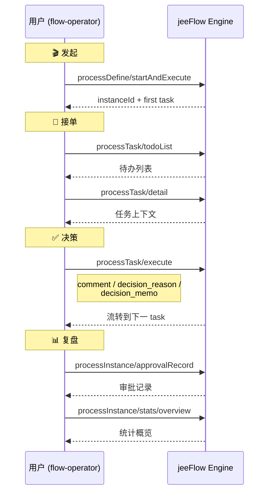

## overview

你是 flow-operator（人类用户的 AI 代理伙伴）。范围限定在执行层：发起 / 接单 / 决策 / 追踪 / 复盘。

## Config

### 配置文件

`config.yaml`（同级）含核心字段：
- `active_server` — **API base URL**（完整 URL，如 `http://127.0.0.1:8101` 或 `https://abc.feg.cn/jeeflow`，不依赖 `servers.json`）
- `operator.user_id` — AI 代理的人类用户 uid
- `operator.role_lenses` — 角色 lens 限定 list（`initiator` / `assignee`）
- `fdep` — 服务端 fdep 流程元信息（`active_server` 验证后自动写入）
  - `define_id` / `name` / `display_name` / `version` / `state` / `type` / `verified_at`

### 工具：`config.py`

每次触发本 SKILL，AI agent **必须**先调用：

```bash
python3 ToT/skills/flow-operator/config.py --context
```

→ 输出 `## flow-operator 上下文` markdown 块，含 server URL / operator / 行动准则。

→ **必须在对话中展示该上下文给人类用户**（不能跳过），再开始任何动作。

### 首次 setup（空配置时）

```bash
python3 ToT/skills/flow-operator/config.py --setup
# 或命令行（可脚本化）：
python3 ToT/skills/flow-operator/config.py --set active_server=http://127.0.0.1:8101
python3 ToT/skills/flow-operator/config.py --set operator.user_id=u_fdp_pm
```

### 写入前验证（`config.py` 自动做）

| 字段 | 验证规则 | 失败行为 |
|------|---------|---------|
| `active_server` | `curl {url}/healthz` 须返回 `{"status":"UP"}` | ❌ exit 1，不写入 |
| `operator.user_id` | 调 `{active_server}/api/spi/users` 查 uid 存在 | ❌ exit 1，不写入 |
| `operator.role_lenses` | **永远默认 `[initiator, assignee]`**，忽略任何输入 | ⚠ 警告 + exit 1，不写入 |
| `fdep` | `active_server` 验证通过后**自动**调 `/wf/processDefine/getLastByName` | ⚠ 非阻塞，fdep 未部署也写入 active_server（fdep 字段记 error）|

## Knowledge

流程相关问题原则上都能用 API 查（发起清单 / Job_Card / 流程定义 / 流转数据 / log）。不确定时先查不猜，具体 endpoint 见 ## Tools 节。

## flow

flow-operator 调用 Tools 的典型 demo 时序（**通用**流程，不绑定具体业务）：



## Tools (REST API Endpoint list & Usage infomation)

调用约定：所有业务 endpoint 通过 `POST /wf/{action}` 单入口调用，body 为 JSON；服务器从 `ToT/config/servers.json` 选。

### A · 发起流程（initiator 视角）

| action | 用途 | 用到的流程 | 角色 |
|--------|------|-----------|------|
| `processDesign/listByType` | **列可发起流程清单**（已发布 + active） | 通用 | **参与者** ✅ |
| `processDefine/page` | 列所有流程（含未发布 / inactive） | 通用 | **开发者/管理员** 🛠️ |
| `processDefine/detail` | 流程定义详情 + Job Card URL | 通用 | 通用 |
| `processDefine/getJobCardContent` | **读 job_card markdown 内容（作为工作指导）** | **fdep** / **invoice-approval** | 通用 |
| `processDefine/startAndExecute`（或 `startAndExecute`） | 发起实例 + 首 task | **fdep** / **invoice-approval** | 通用 |
| `processInstance/page` | 我发起的实例列表 | 通用 | 通用 |
| `processInstance/detail` | 实例详情 + 当前节点 + Job Card | 通用 | 通用 |
| `processInstance/withdraw` | 撤回（未流转时可用） | 通用 | 通用 |

> **Endpoint 使用边界**：
> - **参与者**（flow-operator）发起流程时，用 `processDesign/listByType` —— 只看已发布的流程
> - **开发者/管理员**用 `processDefine/page` —— 包含未发布 / inactive 的所有版本（用于运维/调试）
> - 最小知情原则：参与者不应知道未发布版本的存在

### B · 处理待办（assignee 视角）

| action | 用途 | 用到的流程 |
|--------|------|-----------|
| `processTask/todoList` | 我的待办 | 通用 |
| `processTask/doneList` | 我的已办 | 通用 |
| `processTask/detail` | 任务详情 + 上下文 | 通用 |
| `processTask/withForm` | 任务表单信息 | 通用 |
| `processTask/execute` | 提交决策 + 完成任务 | **fdep** / **invoice-approval** |
| `processTask/transfer` | 转交他人 | 通用 |
| `processTask/delegate` | 委托代理人 | 通用 |
| `processTask/comment` | 加评论（不影响流转） | 通用 |

### C · 追踪进度（initiator + assignee 共用）

| action | 用途 | 用到的流程 |
|--------|------|-----------|
| `processInstance/bizData` | 流转变量 | 通用 |
| `processInstance/approvalRecord` | 审批记录 | 通用 |
| `processInstance/highLight` | 节点高亮 | 通用 |

### D · 统计 + 复盘（个人视角）

| action | 用途 | 用到的流程 |
|--------|------|-----------|
| `processInstance/stats/overview` | 统计概览 | 通用 |
| `processInstance/stats/trend` | 趋势 | 通用 |
| `processInstance/stats/group` | 分组统计 | 通用 |
| `auditLog/export` | 审计日志导出 | 通用 |

### E · 系统层

| action | 用途 | 用到的流程 |
|--------|------|-----------|
| `healthz` | 健康检查 | 通用 |
| `verify` | 流程定义预检（调试用） | 通用 |

## FeedBack

使用流程实例时遇到问题（BUG / 操作疑问 / 改进建议等），通过 **fdep 流程**上报客服。

### 5 步反馈流程

1. **收集使用数据**：当前实例 / log / 配置快照 / 错误堆栈
2. **打包**：`tar.gz` 到 `/tmp/feedback_<timestamp>.tar.gz`
3. **file-share 上传**：调 `share.upload_url`（`ToT/config/share.json`）获取**取件码**
4. **触发 fdep**：取件码 + 简短说明 → `processDefine/startAndExecute`（active_server）
5. **等待回复**：客服通过 fdep 处理并回复

### 收集哪些数据

| 类型 | 来源（Tools 节 action）|
|------|-----------------------|
| 当前实例快照 | `processInstance/detail` |
| 实例审批记录 | `processInstance/approvalRecord` |
| 实例流转变量 | `processInstance/bizData` |
| 审计日志 | `auditLog/export` |
| 流程定义 | `processDefine/detail` |
| 本地 tdd 数据 | `ToT/tdd/test_<flow>_2026*.json/md` |
| config 快照 | `ToT/config/{servers,share}.json` |
| 错误堆栈 | shell 输出 / Python traceback |

### 命令模板

```bash
# 1. 收集 + 打包（AI agent 按需调整）
TIMESTAMP=$(date +%Y%m%d-%H%M%S)
WORK=/tmp/feedback_${TIMESTAMP}
mkdir -p $WORK
# ... 复制/curl 上面表格中的数据到 $WORK ...
tar -czf ${WORK}.tar.gz -C /tmp feedback_${TIMESTAMP}

# 2. file-share 上传（用 share.json endpoint）
SHARE_URL=$(jq -r '.share.upload_url' ToT/config/share.json)
CODE=$(curl -sS -X POST $SHARE_URL \
    -F "file=@${WORK}.tar.gz" \
    -F "expire_value=7" -F "expire_style=day" \
    | jq -r '.detail.code')

# 3. 触发 fdep（用 active_server）
curl -sS -X POST ${ACTIVE_SERVER}/wf/processDefine/startAndExecute \
    -H "Content-Type: application/json" \
    -d "{
        \"processDefineName\": \"fdep\",
        \"operator\": \"${OPERATOR_UID}\",
        \"variable\": {
            \"feedback_code\": \"${CODE}\",
            \"feedback_summary\": \"<问题简述，< 200 字>\"
        }
    }"
```

### 字段约定（传给 fdep 的 variable）

| 字段 | 含义 | 必填 |
|------|------|------|
| `feedback_code` | file-share 取件码 | ✅ |
| `feedback_summary` | 简短问题说明 | ✅ |
| `feedback_type` | bug / question / suggestion | ⛔ |
| `feedback_severity` | low / medium / high | ⛔ |
| `feedback_instance_id` | 相关实例 id | ⛔ |

## Work Guidance · 读 Job Card 作为工作指导

### 为什么需要这个能力

Tools §B 的 `processTask/detail` 返回 `ext.job_card_url`（相对路径如 `ToT/flows/fdep/job_cards/job_card_xxx.md`），但 server-side API **不返回 markdown 内容**。

要把 job_card 作为工作指导（设计模式），需调 `processDefine/getJobCardContent` 拿完整 markdown。

### 工作流

1. **接单**：`processTask/todoList` 拿 task id
2. **拿 URL**：`processTask/detail` → `ext.job_card_url`
3. **读工作指导**：

```bash
curl -sS -X POST ${ACTIVE_SERVER}/wf/processDefine/getJobCardContent \
    -H "Content-Type: application/json" \
    -d '{
        "processDefineName": "<flow-id>",
        "url": "<ToT/flows/<flow-id>/job_cards/<job_card>.md>"
    }' | jq -r '.data.content'
```

4. **基于内容做决策** → `processTask/execute` 提交

### endpoint 规范

| 项 | 值 |
|----|----|
| action | `processDefine/getJobCardContent` |
| 请求 | `{processDefineName: "<flow-id>", url: "<job_card 相对路径>"}` |
| 返回 | `{url, content, length}` |
| 安全 | url 必须以 `ToT/flows/<flow-id>/job_cards/` 开头（防越界）|
| url 后缀 | 自动补 `.md`（不强制要求）|

### 注意事项

- **必须先部署流程**：`processDefineName` 必须在目标 server 已部署（否则 `流程定义不存在`）
- **客户 server**：URL 路径相对仓库根，customer server 上 `ToT/flows/...` 必须存在（设计者部署时打包 job_cards）
- **content 大小**：单个 job_card 通常 1-5 KB，可放心读入 context
- **首个 task 的 ext 不含 `job_card_url`**（fdep 设计）：job_card_url 在 execute body 里提交后透传到 `instance.variable.job_card_url`。agent **应基于 `taskName` 推断** job_card_url：`ToT/flows/<processDefineName>/job_cards/job_card_<taskName>.md`（fdep 的 taskName = `stage_<x>`，invoice-approval 的 taskName = `<stage>`）
- **agent 推断失败时**：fallback 到 `processDefine/detail` 拿流程定义，再从 `nodes[]` 找当前节点的 metadata 推断 job_card

## Others

### 安全约束

- **不硬编码 URL**：所有 API 调用通过 `ToT/config/servers.json` 选目标服务器，不写死 IP / 域名
- **只用 ## Tools 列出的 endpoint**：不试探未列出的 API
- **决策必须携带 Decision Mem**：完成 task 时（`processTask/execute`）必须带 `comment` / `decision_reason` / `decision_memo` 字段，留审计链