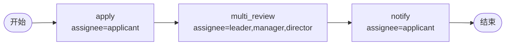

# BDD Task 42: assignee 多 actor + applicant 跨发起人（PASS）

- **时间**：2026-09-17 14:48:00（TS=20260917144800）
- **JSON 定义**：`./bdd/bdd-assignee-multi-applicant_20260917144800.json`
- **服务**：main.py（PID 3446706）

## 1. 场景设计



**关键**：applicant 字段 = 流程发起人（不是写死的 user1）。

## 2. 测试结果

用 **userA** 发起：

| 步骤 | active | actors |
|---|---|---|
| startAndExecute (userA) | multi_review | leader, manager, director |
| leader agree | notify | **userA**（不是 user1） |
| userA agree | 0 (state=20) | — |

历史：`['apply', 'multi_review', 'notify', 'end']` ✅

## 3. 关键发现

1. **applicant 解析为发起人**：assignee='applicant' 自动替换为 `inst.operator`
2. **多 actor assignee**：`leader,manager,director` 创建 1 个 task 含 3 actor（**与会签 performType 不同**）
3. **任一 actor 可处理**：leader 提交后流转（manager/director 不需全部完成）
4. **notify 节点 applicant**：actor = userA（实际发起人，不是流程定义中的 user1）

## 4. 引擎行为

`engine.py:_resolve_actors`:
```python
if "applicant" in token:
    token = token.replace("applicant", inst.operator)
```

## 5. 文档改进

- docs/flow.md §3.3 增强：applicant 变量替换机制
- docs/known-issues.md 无新增（行为正确）
