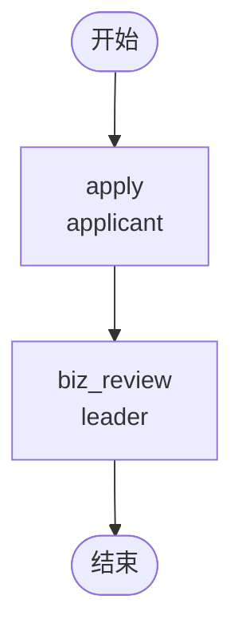

# BDD Task 19: 业务流 + 拦截器测试（PASS）

- **时间**：2026-09-17 13:28:00（TS=20260917132800）
- **JSON 定义**：
  - `bdd-business-interceptor_20260917132800.json`（含 postInterceptors=POST_ONE）
  - `bdd-business-interceptor-empty_20260917132800.json`（无 postInterceptors）
- **服务**：main_pg.py

## 1. 场景设计

业务流（type=business）+ 拦截器声明测试：

| Case | 流程配置 | 期望 | 实测 |
|---|---|---|---|
| A | type=business + postInterceptors=POST_ONE（未注册） | ValueError 阻断启动 | ✅ 99999999 "postInterceptors 声明的拦截器未注册: POST_ONE" |
| B | type=business + postInterceptors="" | 正常流转 | ✅ state=20 |

## 2. 流程图



## 3. 关键引擎机制（实测验证）

**`postInterceptors` 校验（`engine.py:497-531` `_resolve_interceptors`）**：
- 流程定义顶层 `postInterceptors` 字段（逗号分隔）→ 按名从 `engine.ext.interceptor_registry` 取
- **声明中存在未注册名时立即抛 ValueError**（不静默跳过）— **测试中 startAndExecute 即失败**
- 错误不写缓存：每次都重新校验（保证持续报错）

**`preInterceptors` 行为**：
- 文档保留字段，但引擎 `_resolve_interceptors` 只读 `postInterceptors`
- 即 `preInterceptors` 在当前 Python 引擎**未生效**（待 v1.5+ 实现）

**type=business vs approval**：
- 路由分发无差异（实测 Case B 正常流转）
- 业务类型用于流程引擎外部区分（前端 UI / 报表分类）

## 4. 测试结果

### Case A：未注册 postInterceptors

```bash
$ curl -X POST .../startAndExecute
{"code":99999999,"msg":"postInterceptors 声明的拦截器未注册: POST_ONE"}
```

- ❌ startAndExecute 立即失败
- ✅ 错误信息精确指出未注册名（便于排查）

### Case B：空 postInterceptors

| 步骤 | 操作 | state | active | 备注 |
|---|---|---|---|---|
| startAndExecute | user1 apply | 10 | biz_review [leader] | ✅ |
| leader agree | biz_review → end | 20 | 0 | ✅ |

**全部 PASS（含 Case A 错误行为符合预期）** ✅

## 5. 复盘 & docs 改进

### 5.1 关键发现

1. **`postInterceptors` 校验时机**：startAndExecute 时立即校验（解析 flow content 即触发），不在拦截器触发时才校验
2. **未注册拦截器零容忍**：抛 ValueError，流程阻断，不会静默运行
3. **`preInterceptors` 字段保留但未生效**：Python 引擎 `_resolve_interceptors` 只读 postInterceptors；preInterceptors 实际不生效（待实现）

### 5.2 docs/flow.md §2 顶层字段改进

**澄清 `preInterceptors/postInterceptors` 行为**：
- `type: "business"` 业务流标识（用于前端/报表分类）
- `preInterceptors`：**当前 Python 引擎未实现**（待 v1.5+）— 写字段不影响行为
- `postInterceptors`：已实现，逗号分隔拦截器名 → 从 interceptor_registry 取
  - 未注册时立即抛 ValueError 阻断流程
  - 已注册但 pre_handle 返回 False → 阻断 task 流转

### 5.3 已知问题（新发现 §34）
- **`preInterceptors` 静默未实现**：设计文档提到该字段，但 Python 引擎 `_resolve_interceptors` 只读 postInterceptors，写 `preInterceptors` 不会生效
- 拦截器注册需要 main_pg.py/main.py 注册到 `engine.ext.interceptor_registry`，当前示例未注册任何内置拦截器

## 6. 后续
- §34 preInterceptors 静默 → 加入 known-issues.md
- docs/flow.md §2 §3 改进（docs 复盘任务执行）
