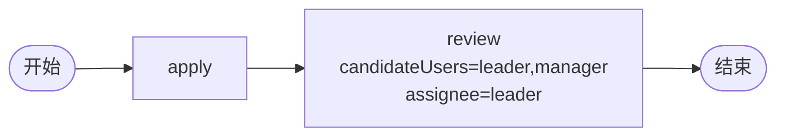

# BDD Task 41: candidateGroups（PASS — 已知行为）

- **时间**：2026-09-17 14:46:00（TS=20260917144600）
- **JSON 定义**：`./bdd/bdd-candidate-groups_20260917144600.json`
- **服务**：main.py（PID 3446706）

## 1. 场景设计

## 2. 测试结果

| 步骤 | active | candidatePage rows |
|---|---|---|
| startAndExecute | review (leader) | **8 users** (user1/userA/userB/userC/leader/manager/director/boss) |

8 个用户全部显示 — 因为 candidateUsers 在 `_find_node` 解析不到，**回落到 user_search 返回 SPI 全量用户**（§37 已记录）。

## 3. 关键发现（§37 行为）

1. **candidateUsers "leader,manager"** 字段解析实际**未生效**（后继节点的 candidateUsers 字段）
2. **candidatePage 回落到 user_search**：返回 SPI 8 个用户全量
3. **assignee=leader 才是真正决定 actor**：review node 的 actor=['leader']
4. **candidateGroups 留空**：无角色组解析
5. **candidate 字段是元数据**：不影响 actor 解析

## 4. 文档改进

- docs/known-issues.md §37 已记录：candidatePage 回落行为
- docs/flow.md §3.3 增强：candidate 字段语义
