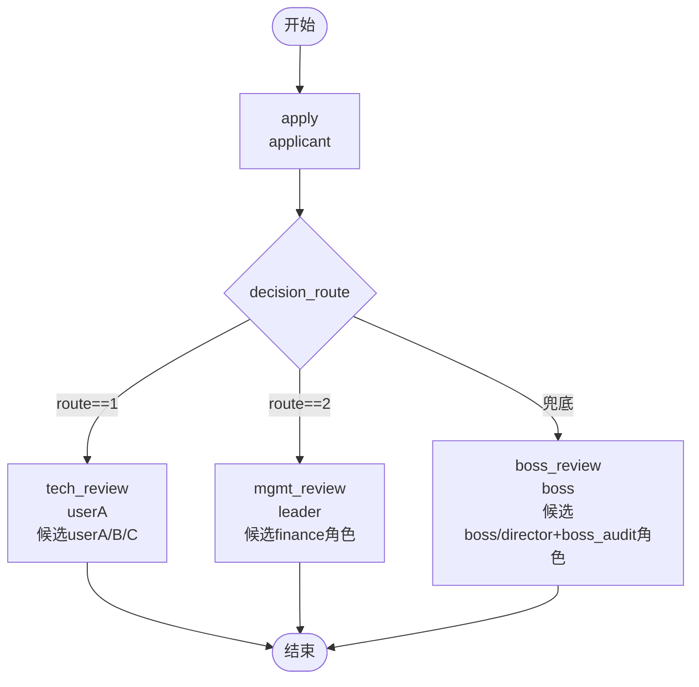

# BDD Task 18: 多候选人+多分支审批（PASS）

- **时间**：2026-09-17 13:25:00（TS=20260917132500）
- **JSON 定义**：`./bdd/bdd-candidate-multi-route_20260917132500.json`
- **服务**：main_pg.py + v1.5.1-PG/v1.5.2-PG/v1.5.3-PG

## 1. 场景设计

申请-路由决策-不同审批分支 + candidate 候选池：

| 节点 | 类型 | assignee | candidateUsers | candidateGroups |
|---|---|---|---|---|
| start | start | — | — | — |
| apply | task | applicant | — | — |
| decision_route | decision | — | — | — |
| tech_review | task | **userA** | userA,userB,userC | — |
| mgmt_review | task | **leader** | — | finance |
| boss_review | task | **boss** | director,boss | boss_audit |
| end | end | — | — | — |

**路由规则**（route 变量）：
- route==1 → tech_review
- route==2 → mgmt_review
- 其他（含 route==3）→ boss_review（默认边）

## 2. 流程图

## 3. 关键引擎机制

**candidateUsers/candidateGroups 行为**：
- 仅用于**前端候选分页过滤**（`processTask/candidatePage` API 查询候选任务时按 user/role 过滤）
- **不参与 actor 解析**（§26/§27 已记录 — `_resolve_actors` 仅读 assignee / handler，不读 candidate）
- 实际处理人 = `assignee` 字段指定的用户

**actor fallback**：
- 若 `assignee` 是占位（如 "leader"），会被解析为 `inst.operator`（apply 时是 user1）
- 测试中需要确保 assignee 是真实 user id（userA/leader/boss 等 SPI 中存在的用户）

## 4. 测试结果

### Case route=1 → tech_review

| 步骤 | 操作 | state | active | 备注 |
|---|---|---|---|---|
| startAndExecute | user1 apply + route=1 | 10 | tech_review [userA] | decision_route → tech_review ✅ |
| userA agree | tech_review → end | 20 | 0 | DONE ✅ |

### Case route=2 → mgmt_review

| 步骤 | 操作 | state | active | 备注 |
|---|---|---|---|---|
| startAndExecute | user1 apply + route=2 | 10 | mgmt_review [leader] | decision_route → mgmt_review ✅ |
| leader agree | mgmt_review → end | 20 | 0 | DONE ✅ |

### Case route=3 → boss_review（兜底边）

| 步骤 | 操作 | state | active | 备注 |
|---|---|---|---|---|
| startAndExecute | user1 apply + route=3 | 10 | boss_review [boss] | decision_route fallback → boss_review ✅ |
| boss agree | boss_review → end | 20 | 0 | DONE ✅ |

**全部 PASS** ✅

## 5. 复盘 & docs 改进

### 5.1 关键确认

1. **decision 兜底边**：决策节点按顺序评估 expr，首个 true 即流转；无 true 时 fallback 到第一条出边（即使无 expr）— 本任务 boss_review 即 fallback 边
2. **candidateUsers/Groups 仅 UI 用途**：actor 始终由 assignee 解析，不受 candidate 影响
3. **multi-candidate page query**：可通过 `processTask/candidatePage` API + operator=候选用户查询候选任务（本次未实测该 API）

### 5.2 docs/flow.md §3.4 decision 节点改进

**新增「decision 兜底边」说明**：
- 决策节点按 edge 顺序评估，首个 expr=true 即流转
- 所有 expr 都不匹配 → **fallback 到第一条出边**（即使 expr=""）
- 设计建议：第一条出边用 expr=""（默认/兜底），后续出边用显式 expr

### 5.3 docs/flow.md §3.3 task 节点改进

**candidateUsers/candidateGroups 字段语义明确**：
- 仅用于 `processTask/candidatePage` API 查询时过滤
- 不影响 actor 解析（actor 仍由 assignee / handler 决定）
- 测试时 actor 必须是真实 user id

### 5.4 已知问题（新发现 §33）
- **decision 兜底行为测试建议**：写流程图时务必设计一条 `expr=""` 的兜底边，确保所有变量值都有流转路径
- 已有 flows/*.json 多数满足该约束（decision 第一边通常无 expr）

## 6. 后续
- §33 decision 兜底 → 加入 known-issues.md
- docs/flow.md §3.3 §3.4 改进（docs 复盘任务执行）
