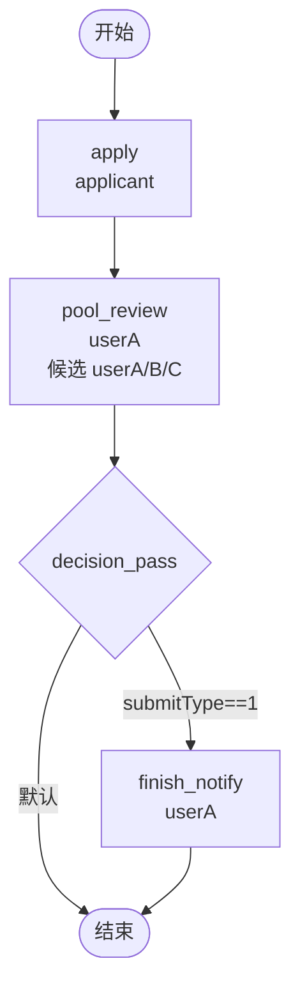

# BDD Task 21: 候选人池接单 + candidatePage API（PASS）

- **时间**：2026-09-17 13:50:00（TS=20260917135000）
- **JSON 定义**：`./bdd/bdd-candidate-pool-take_20260917135000.json`
- **服务**：main.py（内存后端，PID 3425647）

## 1. 场景设计

多人审批池业务（运营/客服/HR 等）：

| 节点 | 类型 | assignee | candidateUsers | 说明 |
|---|---|---|---|---|
| start | start | — | — | 入口 |
| apply | task | applicant | — | 发起申请 |
| pool_review | task | **userA** | userA,userB,userC | 审批池（3 人候选）|
| decision_pass | decision | — | — | submitType==1 → finish_notify |
| finish_notify | task | userA | — | 通知发起人 |
| end | end | — | — | 结束 |

**关键测试**：`processTask/candidatePage` API 实际行为

## 2. 流程图



## 3. 关键 API 行为（实测）

**`processTask/candidatePage` 实际语义**：
- **不是**按 operator 查候选任务（实测 operator=userA/B/leader 全部返回空）
- **是**按 `processTaskId`（当前任务 ID）查**后继节点**的 candidateUsers/candidateGroups
- 返回的候选用户列表用于前端选人组件（决定下一步可处理人）

### 3.1 测试 1：apply → pool_review 后继候选

```bash
# apply 完成时查 pool_review 的 candidateUsers
curl /wf/processTask/candidatePage -d '{"processTaskId":<apply_task_id>,"pageNum":1,"pageSize":20}'
# 响应：3 条候选 userA/userB/userC ✅
```

### 3.2 测试 2：pool_review → finish_notify 后继候选

```bash
# pool_review 完成时查 finish_notify（无 candidateUsers）→ 回落 user_search
curl /wf/processTask/candidatePage -d '{"processTaskId":<pool_review_task_id>,"pageNum":1,"pageSize":20}'
# 响应：8 条候选（SPI 全量 user1/userA/userB/userC/leader/manager/director/boss）
# 原因：finish_notify 无 candidateUsers/candidateGroups，引擎回落 user_search 钩子
```

### 3.3 candidatePage 行为细节

| 输入 | 行为 | 实测响应 |
|---|---|---|
| `processTaskId` 不存在 | ValueError | `code=99999999` "任务不存在" |
| `processTaskId` 缺失 | ValueError | `code=99999999` "processTaskId 缺失" |
| `operator` 参数 | **不参与过滤** | 总是返回候选池全量（不按 operator 过滤）|
| 后继节点有 candidateUsers | 返回该字段值（逗号分隔 list）| `[{userId, realName, ...}]` |
| 后继节点有 candidateGroups | SPI role_code → users | `[{userId, realName, ...}]` |
| 后继节点无 candidate 字段 | 回落 user_search | SPI 全量 user（8 条）|

## 4. 完整流程验证

| 步骤 | 操作 | state | active | 备注 |
|---|---|---|---|---|
| startAndExecute | user1 apply | 10 | pool_review [userA] | assignee=userA ✅ |
| userA agree | pool_review → decision_pass → finish_notify | 10 | finish_notify [userA] | decision submitType=1 命中 ✅ |
| userA agree | finish_notify → end | 20 | 0 | DONE ✅ |

**全部 PASS** ✅

## 5. 复盘 & docs 改进

### 5.1 关键发现

1. **candidatePage 不是"按 operator 查候选任务"** — 是"按当前任务查后继节点候选池"
2. **candidateUsers 字段在 task 节点配置时被读取** — 用于下一步可处理人列表
3. **无 candidate 时回落 user_search** — 返回 SPI 全量用户
4. **actor 仍由 assignee 决定**（§26/§27 已知问题）— candidate 字段不影响 actor

### 5.2 docs/flow.md §3.3 task 节点改进

**澄清 `candidateUsers/candidateGroups` 实际用途**：
- 配置在 task 节点 properties（根或 field 下）
- 配合 `processTask/candidatePage` API 使用：传 `processTaskId`（**非 operator**），返回后继节点的候选池
- 后继节点无 candidate 字段时，回落 user_search 返回 SPI 全量用户
- **不参与 actor 解析**（§26/§27 已记录）

### 5.3 docs/actions.md 改进

**`processTask/candidatePage` 参数澄清**：
- 必传：`processTaskId`（当前任务 ID，不是 instance ID）
- 选传：`pageNum`、`pageSize`（默认 1/10）
- **不要传 operator**（不影响结果）
- 响应：`{rows: [{userId, realName, deptId, ...}], total}`

### 5.4 docs/flow.md §3.4 决策节点改进

**decision submitType 路由确认**：
- 决策节点按 edge 顺序评估 expr
- expr 命中：`#submitType==1` → 流转到对应边
- 无 expr 命中：fallback 到第一条无 expr 边
- 测试 BDD Task 18/21 中 submitType=1 命中 expr 边流转正确

## 6. 后续

- docs/flow.md §3.3 + docs/actions.md 更新
- 已知问题无新增（行为符合预期）
