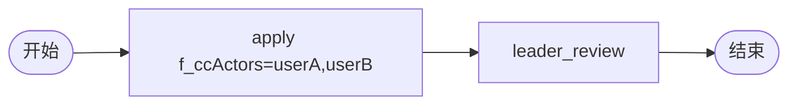

# BDD Task 34: 抄送 CC（PASS）

- **时间**：2026-09-17 14:32:00（TS=20260917143200）
- **JSON 定义**：`./bdd/bdd-cc-test_20260917143200.json`
- **服务**：main.py（PID 3444317）

## 1. 场景设计

## 2. CC API

| API | 路径 | 行为 |
|---|---|---|
| 发起时自动 CC | startAndExecute variables.f_ccActors="userA,userB" | 自动创建 CC 实例 |
| 手动添加 CC | POST /wf/processInstance/createCCInstance | actorIds=[userC] |
| 我的抄送 | POST /wf/processInstance/ccList operator=userA | 分页返回 |
| 关闭 CC | POST /wf/processInstance/updateCCStatus | 标记已读 |

## 3. 测试结果

| Case | 操作 | 结果 |
|---|---|---|
| A | f_ccActors=userA,userB → 启动 | userA/B ccList 含实例 ✅ |
| B | 手动 createCCInstance userC | userC ccList 含实例 ✅ |
| C | leader agree → state=20 | ccList 中实例 state=20 ✅ |
| D | updateCCStatus userA | userA 标记已读 ✅ |

## 4. 关键发现

1. **`f_ccActors` 触发自动抄送**：发起时多个 actor 用逗号分隔
2. **CC 实例独立存储**：`MemoryRepository.create_cc_instance` 创建抄送记录
3. **CC state 跟随实例**：流程完成后 CC 记录的 state 也变 20
4. **CC 关闭**：mark as read，状态字段更新
5. **EventType.CC_CREATE**：每个抄送人触发事件
6. **手动 CC**：createCCInstance API 与发起路径同语义

## 5. 文档改进

- docs/flow.md §4 增强：CC API 速查表 + 触发时机
- docs/known-issues.md §50 新增：CC state 跟随实例 state
