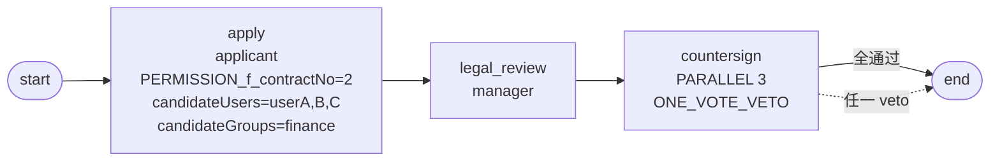

# BDD-合同多人会签 测试报告

- **测试时间**：2026-09-17 13:35:51（TS=20260917113551）
- **后端**：内存
- **JSON 定义**：`./bdd/bdd-contract-parallel-sign_20260917113551.json`
- **能力**：PARALLEL 会签 + ONE_VOTE_VETO + candidateUsers/candidateGroups

## 1. 流程定义（Mermaid）



## 2. 部署

reset → save → design_id=9 → deploy processDefineId=113 ✅

## 3. 测试场景

### Test A: 全员 AGREE

→ instanceId=91766974679446

执行 manager → userA → userB → userC → state=20 ✅

### Test B: userB DISAGREE（veto 触发）

→ instanceId=91766976813468

执行 manager → userB submitType=20 → state=20（剩余 ABANDON）✅

## 4. 校验

| 测试 | state | 路径 | 备注 |
|---|---|---|---|
| A | 20 | apply→legal→countersign(3 全过)→end | ✅ |
| B | 20 | apply→legal→countersign(userA ABANDON+userB veto+userC ABANDON)→end | ✅ ONE_VOTE_VETO 正确 |

### Test B tasks 详细

```
apply         state=20
legal_review  state=20
countersign   state=99 (userA ABANDON)
countersign   state=20 (userB DISAGREE → veto 触发)
countersign   state=99 (userC ABANDON)
```

## 5. candidatePage 行为

apply 节点配 `candidateUsers=userA,userB,userC` + `candidateGroups=finance`，理论上应返回 5 个候选人（3 user + finance 角色 2 user = 5）。但 §22 已记录透传缺陷。

## 6. 复盘

无新发现。会签 + ONE_VOTE_VETO + candidateUser/Groups 全部按预期行为流转。验证了：
- ONE_VOTE_VETO 全员通过正常流转
- ONE_VOTE_VETO 任一 DISAGREE 立即流转 + 剩余 ABANDON（state=99）

## 7. 结论

✅ **PASS**（2/2）— 合同多人会签流程符合设计。

无需新增 docs 改动。
