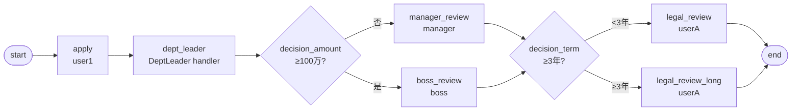

# BDD-合同分级 测试报告

- **测试时间**：2026-09-17 13:52:00（TS=20260917115200）
- **后端**：PG
- **JSON 定义**：`./bdd/bdd-contract-tiered_20260917115200.json`
- **状态**：✅ 4/4 PASS

## 1. 流程定义（Mermaid）

节点数：10（含 start/end），边数：11

## 2. 测试结果

| 测试 | f_amount | f_term | 路径 | state | 结果 |
|---|---|---|---|---|---|
| A 小额短 | 500000 | 24 | manager → legal_review | 20 | ✅ |
| B 小额长 | 500000 | 48 | manager → legal_review_long | 20 | ✅ |
| C 大额短 | 2000000 | 24 | boss → legal_review | 20 | ✅ |
| D 大额长 | 2000000 | 48 | boss → legal_review_long | 20 | ✅ |

## 3. 复盘

### 3.1 关键技术点

1. **二级 decision 嵌套**：先按金额分（manager vs boss），再按期限分（短期 vs 长期法务）。两个 decision 节点串行
2. **DeptLeaderAssignmentHandler**：第一个审批节点用 handler（找发起人部门领导），后续按 decision 分支
3. **节点 id 命名规范**：用业务命名（manager_review / boss_review / legal_review / legal_review_long），不混数字后缀

### 3.2 引擎观察

- ✅ 二级 decision 嵌套工作正常
- ✅ DeptLeaderAssignmentHandler 解析 actor=[leader]（D01 部门领导）
- ✅ handler 与显式 assignee 混用无冲突

### 3.3 改进建议

- 当前无新发现
