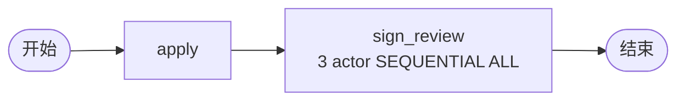

# BDD Task 30: 串行加签 SEQUENTIAL（PASS）

- **时间**：2026-09-17 14:19:00（TS=20260917141900）
- **JSON 定义**：`./bdd/bdd-countersign-seq_20260917141900.json`
- **服务**：main.py（PID 3440125）

## 1. 场景设计

3 个 actor（leader/manager/director）**串行**加签。

## 2. 测试结果

| 步骤 | active | actors |
|---|---|---|
| startAndExecute | sign_review | leader |
| leader agree | sign_review | manager |
| manager agree | sign_review | director |
| director agree | 0 (state=20) | — |

历史：`['apply', 'sign_review', 'end']` ✅

## 3. 关键发现

1. **countersignType=SEQUENTIAL**：3 个 actor **按顺序激活**，每次只有 1 个 ACTIVE
2. **上一人 agree → 下一人 ACTIVE**：流转由引擎自动触发
3. **countersignCompletionCondition=ALL**：最后一人 agree 才推进
4. **3 个 task 实例**：每人 1 个 task（state=20 DONE），不重复创建
5. **activeTaskList 数量**：SEQUENTIAL 时只显示当前激活的 task（不是所有 3 个）

## 4. 文档改进

- docs/known-issues.md §45 新增：SEQUENTIAL 会签 PendingTask 状态
- docs/flow.md §3.3 增强：countersignType PARALLEL/SEQUENTIAL 对照表
