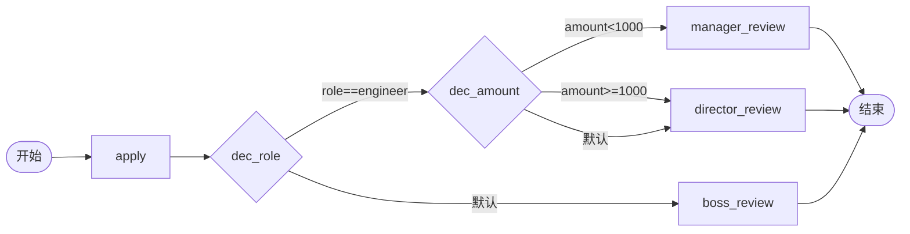

# BDD Task 32: 自定义决策（嵌套 decision + 字符串比较 expr）（PASS + 修复）

- **时间**：2026-09-17 14:23:00（TS=20260917142300）
- **JSON 定义**：
  - `./bdd/bdd-custom-decision_20260917142300.json`（decisionHandler 方案 — 引擎未实现）
  - `./bdd/bdd-custom-decision-nested_20260917142300.json`（嵌套 decision + expr 方案）
- **服务**：main.py（PID 3442481，v1.6.0 修复后）
- **修改文件**：`./main.py`（FIX-T3 v1.6.0: SimpleExprEvaluator 加字符串比较）

## 1. 场景设计



## 2. 关键发现（决策限制）

1. **Python 引擎 `_evaluate_decision` 不调用 `IDecisionHandler`**：仅用 expr + 边 expr 求值（engine.py:353-375）
2. **decisionHandler 接口未实现**：register_decision 注册的自定义处理器**无效**
3. **替代方案**：嵌套 decision + expr 实现多条件决策

## 3. SimpleExprEvaluator v1.6.0 修复（FIX-T3）

### 修复前
```python
# 只支持 #var op number
m = re.match(r"^\s*(#?\w+)\s*(>=|<=|!=|==|>|<)\s*(\d+(?:\.\d+)?)\s*$", expr)
# #role==engineer 不匹配 → return False → 走兜底默认边
```

### 修复后
```python
# 增加字符串相等
m_str = re.match(r'^\s*(#?\w+)\s*(==|!=)\s*"?([A-Za-z0-9_]+)"?\s*$', expr)
# #role==engineer 匹配 → vars.role == 'engineer'
```

## 4. 测试结果

| Case | role | amount | 实际路径 | 结果 |
|---|---|---|---|---|
| A | engineer | 500 | dec_role → dec_amount → manager_review | state=20 ✅ |
| B | engineer | 3000 | dec_role → dec_amount → director_review | state=20 ✅ |
| C | manager | 3000 | dec_role → boss_review (默认) | state=20 ✅ |

**全部 PASS** ✅

## 5. 关键发现

1. **嵌套 decision 实现多条件**：每层 decision 独立 expr
2. **dec_role**：#role==engineer 匹配 → dec_amount；否则 → boss_review（默认）
3. **dec_amount**：#amount<1000 → manager；#amount>=1000 → director；默认 → director
4. **v1.6.0 字符串比较**：`#role==engineer` 现在生效
5. **decisionHandler 接口未实现**：register_decision 注册无效果（建议文档化）

## 6. 文档改进

- docs/known-issues.md §46 新增：Python 引擎 decisionHandler 未实现
- docs/known-issues.md §47 新增：FIX-T3 SimpleExprEvaluator 字符串比较支持
- docs/flow.md §3.4 增强：嵌套 decision 模拟多条件决策
- docs/flow.md §3.4 增强：decisionHandler 实际状态（未实现）

## 7. main.py 修改

```python
# v1.6.0 fix (FIX-T3 2026-09-17 BDD Task 32): 支持字符串相等比较
m_str = re.match(r'^\s*(#?\w+)\s*(==|!=)\s*"?([A-Za-z0-9_]+)"?\s*$', expr)
if m_str:
    key, op, val = m_str.group(1).lstrip("#"), m_str.group(2), str(m_str.group(3))
    actual = vars.get(key)
    if actual is None:
        return False
    if op == "==": return str(actual) == val
    if op == "!=": return str(actual) != val
```
