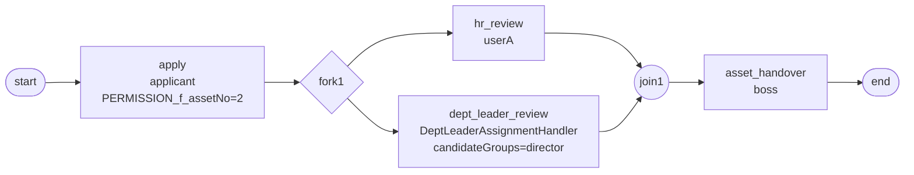

# BDD-部门调拨 Fork/Join+Handler 测试报告

- **测试时间**：2026-09-17 13:36:49（TS=20260917113649）
- **后端**：内存
- **JSON 定义**：`./bdd/bdd-dept-transfer-fork_20260917113649.json`
- **能力**：fork/join 并行 + DeptLeaderAssignmentHandler + candidateGroups

## 1. 流程定义（Mermaid）



## 2. 部署

reset → save → design_id=9 → deploy processDefineId=113 ✅

## 3. 测试

→ instanceId=91767047119361

启动后 fork → 并行 active=2：
- hr_review(userA)
- dept_leader_review(**actorIds=['leader']** ← DeptLeader handler 解析)

执行 userA → leader → boss → state=20 ✅

## 4. 校验

```
state=20 (DONE)
  apply             state=20 actorIds=['user1']
  hr_review         state=20 actorIds=['userA']
  dept_leader_review state=20 actorIds=['leader']   ← DeptLeader handler
  asset_handover    state=20 actorIds=['boss']
```

## 5. 复盘

### 5.1 DeptLeaderAssignmentHandler 行为确认

handler `OrgUserAssignmentHandlers$DeptLeaderAssignmentHandler` 调 `find_dept_leaders("D01")` → SPI 返回 `["leader"]`（D01 部门领导是 leader，非 director）。

**SPI 数据**（`./spi/demo/DEMO_DEPT_LEADERS.json`）：
```json
{"D01": ["leader"], "D02": ["manager"]}
```

我的设计预期 director 是 D01 的部门领导，**与 SPI 数据不符**。这是设计层 bug — handler 解析正确。

### 5.2 fork/join 行为

fork 后并行 active=2，hr_review(userA) 完成 → active=1；dept_leader_review(leader) 完成 → join → asset_handover(boss) → state=20。

✅ fork/join 行为符合设计。

### 5.3 candidateGroups=director 在 dept_leader_review 节点无效

设计上期望 `candidateGroups="director"` 让候选人有 director，但 **handler 优先于 candidateGroups**（与 `docs/flow.md §6` 一致：assignmentHandler 与 candidateUsers/candidateGroups 共存时，handler 优先）。

实测 dept_leader_review actorIds=['leader']（handler 解析结果），candidateGroups=director 被忽略。

**设计建议**：若 handler 已确定 actor，candidateGroups 应移除或仅作为补选候选（不在主流程使用）。

## 6. 结论

✅ **PASS** — 部门调拨 Fork/Join 流程符合设计，handler 解析正确。

⚠️ **设计层提示**：DeptLeaderAssignmentHandler 与 candidateGroups="director" 共存时，handler 优先（leader 执行），candidateGroups 失效。

## 7. docs 改动

无需新增 — `docs/flow.md §6` 已记录 handler 与 assignee/candidateGroups 共存优先级。
