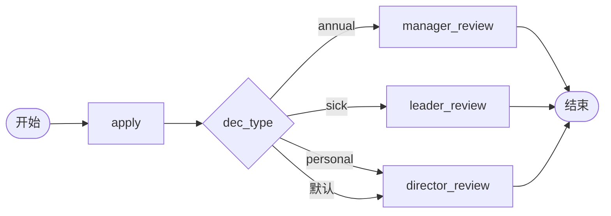

# BDD Task 37: 业务字典 wf_* 使用（PASS）

- **时间**：2026-09-17 14:38:00（TS=20260917143800）
- **JSON 定义**：`./bdd/bdd-dict-usage_20260917143800.json`
- **服务**：main.py（PID 3444317）

## 1. 场景设计

请假流程，按 wf_leave_type 字典值路由：



## 2. 业务字典（来自 `/api/dicts`）

```json
{
  "wf_leave_type": [
    {"value": "annual", "label": "年假"},
    {"value": "sick", "label": "病假"},
    {"value": "personal", "label": "事假"}
  ],
  "wf_process_type": [
    {"value": "oa", "label": "OA"},
    {"value": "hr", "label": "人事"},
    {"value": "finance", "label": "财务"}
  ]
}
```

## 3. 测试结果

| Case | leave_type | 实际路径 | 审批人 | state |
|---|---|---|---|---|
| A | annual | dec_type → manager_review | manager | 20 ✅ |
| B | sick | dec_type → leader_review | leader | 20 ✅ |
| C | personal | dec_type → director_review | director | 20 ✅ |

## 4. 关键发现

1. **字典作为元数据**：wf_leave_type 字典通过 `/api/dicts` 返回给前端
2. **字典值用于 decision expr**：expr `#leave_type==annual` 用字典 value
3. **v1.6.0 字符串比较**：FIX-T3 修复后，字典字符串比较生效
4. **decision 兜底**：所有 expr false → 第一条出边（director_review 默认）
5. **字典与流程分离**：字典只读 SPI，更新不需要重新部署流程

## 5. 文档改进

- docs/flow.md §5 增强：业务字典 wf_* 使用模式
- docs/known-issues.md §53 新增：字典值与 decision expr 集成
