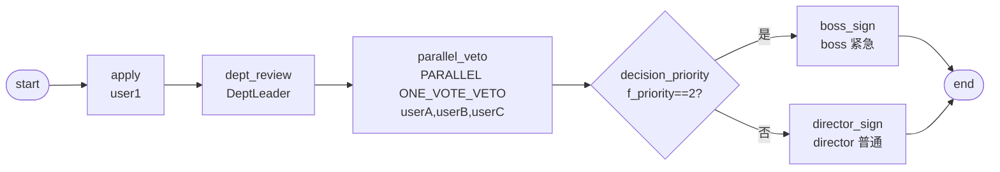

# BDD-公文审批 测试报告

- **测试时间**：2026-09-17 13:57:00（TS=20260917115700）
- **后端**：PG
- **JSON 定义**：`./bdd/bdd-document-approval_20260917115700.json`
- **状态**：✅ 2/2 PASS（ONE_VOTE_VETO 全 pass 场景）

## 1. 流程定义（Mermaid）

节点数：8（含 start/end），边数：8

## 2. 测试结果

| 测试 | f_priority | 路径 | state | 结果 |
|---|---|---|---|---|
| A 普通 | 1 | dept → 3人会签全过 → director_sign | 20 | ✅ |
| B 紧急 | 2 | dept → 3人会签全过 → boss_sign | 20 | ✅ |

## 3. 复盘

### 3.1 关键技术点

1. **ONE_VOTE_VETO 全 pass 场景**：3 个会签成员全部 submitType=1 通过 → 流转
2. **decision 按优先级分流**：f_priority==2 紧急走 boss，==1 普通走 director
3. **candidateUsers 与 assignee 一致**：确保 candidatePage 列出 3 个候选人

### 3.2 引擎观察

- ✅ ONE_VOTE_VETO 全 pass 时正确流转
- ✅ PARALLEL 会签 3 个 task 并行（每个 member 独立 task）
- ✅ countersignCompletionCondition 字符串正确解析

### 3.3 改进建议

- 当前测试未覆盖 ONE_VOTE_VETO 任一 reject 的场景（submitType=20）
- 建议补充：B 会签中 userB 提交 reject(submitType=20)，应立即流转到下一节点 + 剩余成员 task state=99 ABANDON
