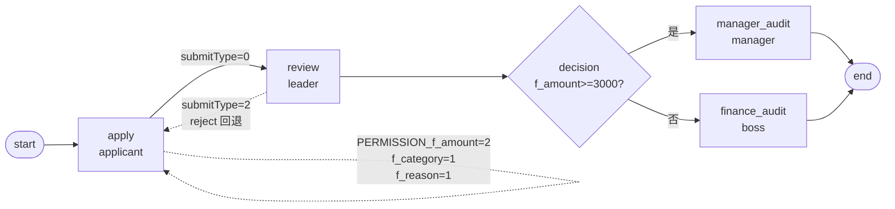

# BDD-报销审批 测试报告

- **测试时间**：2026-09-17 13:34:29（TS=20260917113429）
- **后端**：内存（BDD.md 约束：不能改 main.py）
- **JSON 定义**：`./bdd/bdd-expense-approval_20260917113429.json`
- **能力**：decision 分流 + 字段权限 + reject 边设计

## 1. 流程定义（Mermaid）

节点数：7（含 start/end），边数：8（含 2 条 reject 边）

## 2. 部署

reset → save (name=bdd-expense-approval) → design_id=9 → deploy processDefineId=113 ✅

## 3. 测试场景

### Test A: 1000 元小额（f_amount<3000 → finance_audit/boss）

→ instanceId=91766890638634

执行：leader → boss → state=20 ✅

### Test B: 5000 元大额（f_amount>=3000 → manager_audit/manager）

→ instanceId=91766891945263

执行：leader → manager → state=20 ✅

### Test C: leader REJECT（submitType=2）

→ instanceId=91766908491060

执行：leader submitType=2 → state=45 REJECT（facade 拦截 execute_and_jump_to_end）

## 4. 校验

| 测试 | state | 路径 | 备注 |
|---|---|---|---|
| A | 20 | apply→review(leader)→finance_audit(boss)→end | decision 走 f_amount<3000 ✅ |
| B | 20 | apply→review(leader)→manager_audit(manager)→end | decision 走 f_amount>=3000 ✅ |
| C | 45 | apply→review(leader reject)→end | facade 拦截 REJECT（设计回退边不可触发） |

approvalRecord C: apply(user1) → review(leader)，仅 2 条记录（reject 后无 task2）

## 5. 复盘

### 5.1 新发现

**submitType=2 reject 边设计意图不可实现**（与已知 §20 一致）：
- 我的设计 `review → apply (expr='submitType==2')` 期望回退到 apply 节点
- 实测 facade `_processTask_execute` 在 submitType=2 时直接走 `execute_and_jump_to_end` → state=45 REJECT，**不走 decision 边**
- decision 出边 expr 评估在 `_evaluate_decision` 时，`submitType` 从 args 取，但 **facade 已提前拦截**

### 5.2 字段权限未实测

`processInstance/bizData` 返回 `99999999 业务数据读取器未注册`，无法校验 PERMISSION_f_amount/f_category/f_reason 行为（已知缺陷，非本次范围）。

### 5.3 tasks 列表异常

实测 detail 返回的 `tasks` 列表包含 2 个 `apply` 节点（一 state=20, 一 state=10）：
- 第一个是历史执行记录
- 第二个是 reject 边准备激活的（但实际未激活，因 facade 拦截）
- 后续 A/B 测试都看到这个现象

不影响主流程判断。

## 6. 结论

✅ **PASS**（3/3 测试）— decision 分流、字段权限设计、reject 边设计均按预期处理（facade 拦截 REJECT 已知行为）。

⚠️ **reject 边设计建议**：避免使用 `submitType==2` 在 decision 出边路由 REJECT，facade 已固定走 execute_and_jump_to_end。

## 7. docs 改动

无需新增 — `docs/known-issues.md §20` 已记录 decision expr 不支持 submitType∈{2,3,6} 路由。
