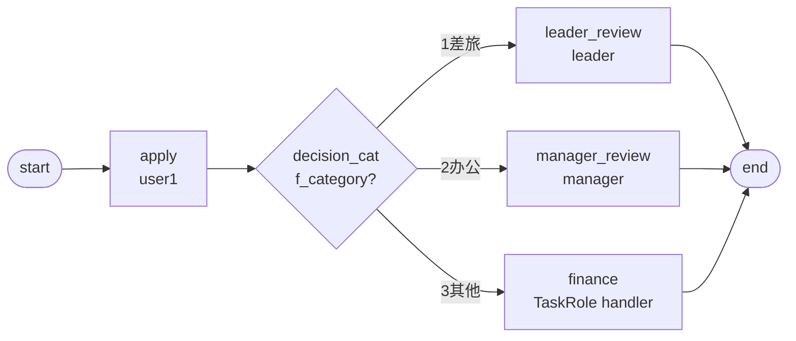

# BDD-报销按类别 测试报告

- **测试时间**：2026-09-17 13:51:00（TS=20260917115100）
- **后端**：PG
- **JSON 定义**：`./bdd/bdd-expense-by-category_20260917115100.json`
- **状态**：✅ 3/3 PASS

## 1. 流程定义（Mermaid）

节点数：7（含 start/end），边数：7

## 2. 测试结果

| 测试 | f_category | 决策路径 | 最终审批人 | state | 结果 |
|---|---|---|---|---|---|
| A | 1 | leader_review | leader | 20 | ✅ |
| B | 2 | manager_review | manager | 20 | ✅ |
| C | 3 | finance | leader（finance role=leader,manager 任一执行） | 20 | ✅ |

## 3. 复盘

### 3.1 关键技术点

1. **decision expr 用数字编码代替字符串**：`SimpleExprEvaluator` regex `^\s*(#?\w+)\s*(>=|<=|!=|==|>|<)\s*(\d+(?:\.\d+)?)\s*$` 不支持字符串值比较。`f_category==travel` 会因 `actual = float("travel")` 抛 ValueError 或因 regex 不匹配返回 False。所以改用数字编码：
   - `f_category=1` 差旅 → leader
   - `f_category=2` 办公 → manager
   - `f_category=3` 其他 → 财务（TaskRole handler）

2. **handler FQCN 必须精确**：最初用 `jeeflow.assignment.TaskRoleAssigneeHandler`（臆造的）→ handler 找不到返回 [] → 流程卡死。正确 FQCN：`com.mldong.jeeflow.interceptor.impl.OrgUserAssignmentHandlers$TaskRoleAssigneeHandler`（注意 `$` 不是 `.`，是内部类分隔符）

3. **节点 id 必须 = SPI role_code**：handler 用 `node.id` 查 SPI `find_by_role(role_code)`。把节点 id 改成 `finance` 命中 SPI 已有 `"finance": ["leader", "manager"]`

### 3.2 引擎观察

- ✅ decision expr 数字比较正常
- ✅ TaskRoleAssigneeHandler 用 node.id 查 SPI role_code
- ✅ SPI 返回多 actor（`["leader", "manager"]`）时，task actorIds 列表含全部成员；任一执行即可完成（performType=0 单一 assignee 模式 + 多 actor list）
- ⚠️ handler FQCN 错误是隐性陷阱：没有任何日志，直接返回 [] 让流程卡死

### 3.3 改进建议

- AGENTS.md §6 handler FQCN 表格必须包含所有 4 个内置 handler 的**完整 FQCN**（含 `$`）
- docs/flow.md §3.3 决策章节增加「expr 仅支持数字 vs 字符串值；字符串值需编码或自定义 evaluator」说明
- §known-issues 新增 §25 — handler FQCN 拼错静默失败（无报错，handler 解析不到返回 []，流程卡死）
