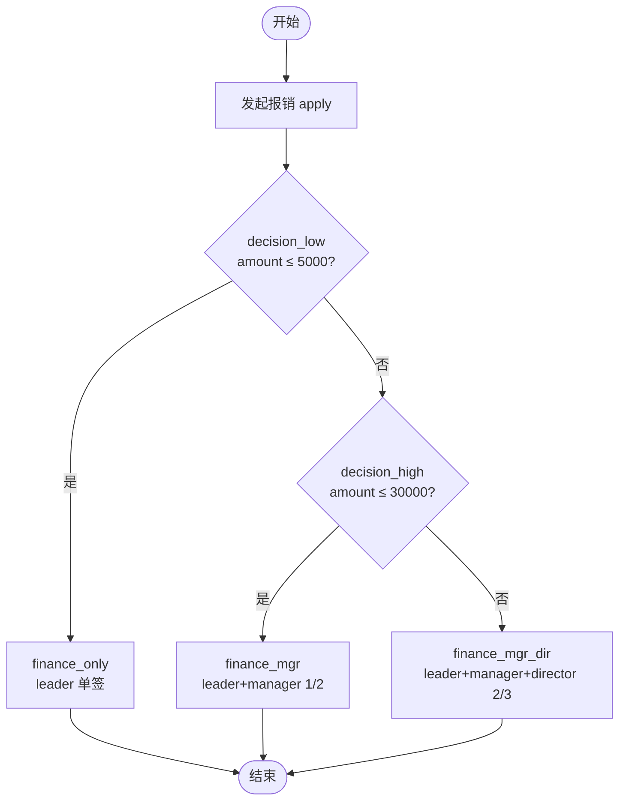

# BDD Task 16: 报销-金额分层比例会签（PASS）

- **时间**：2026-09-17 13:20:00（TS=20260917132000）
- **JSON 定义**：`./bdd/bdd-expense-ratio-tiered_20260917132000.json`
- **服务**：main_pg.py (PID 3421067) + main_pg.py v1.5.1-PG/v1.5.2-PG/v1.5.3-PG 修复

## 1. 场景设计

按报销金额分三档走不同审批路径：

| 档位 | 金额区间 | 审批节点 | 会签类型 | 阈值 |
|---|---|---|---|---|
| 小额 | ≤5000 | finance_only | 单签 | leader 通过即流转 |
| 中额 | 5001~30000 | finance_mgr | 比例会签 (RATIO) | 1/2 通过 |
| 大额 | >30000 | finance_mgr_dir | 比例会签 (RATIO) | 2/3 通过 |

**关键引擎能力**：
- 决策节点按金额分支（双层 decision 链：`decision_low` → `decision_high`）
- `countersignType=PARALLEL` + `countersignCompletionCondition="#nrOfCompletedInstances>=N"`（RatioCapableEngine 扩展）
- 阈值满足时自动 `abandon` 剩余 DOING task（taskState=99 ABANDON）并推进下游

## 2. 流程图

## 3. 测试结果

### 3.1 Case 小额（amount=3000）

| 步骤 | 操作 | state | active tasks | 备注 |
|---|---|---|---|---|
| startAndExecute | user1 发起 | 10 | finance_only [leader] | decision_low → finance_only ✅ |
| leader agree | finance_only → end | 20 | 0 | DONE ✅ |

### 3.2 Case 中额（amount=15000）

| 步骤 | 操作 | state | active tasks | 备注 |
|---|---|---|---|---|
| startAndExecute | user1 发起 | 10 | finance_mgr×2 [leader,manager] | decision_low → decision_high → finance_mgr ✅ |
| leader agree | 1/2 满足 → flow | 20 | 0 | manager task 自动 ABANDON (state=99) ✅ |

### 3.3 Case 大额（amount=50000）

| 步骤 | 操作 | state | active tasks | 备注 |
|---|---|---|---|---|
| startAndExecute | user1 发起 | 10 | finance_mgr_dir×3 [leader,manager,director] | decision_high → finance_mgr_dir ✅ |
| leader agree | 1/3 不满足 → DOING | 10 | finance_mgr_dir×2 [manager,director] | 仍卡会签 ✅ |
| manager agree | 2/3 满足 → flow | 20 | 0 | director task 自动 ABANDON (state=99) ✅ |

**全部 PASS** ✅

## 4. 复盘 & docs 改进

### 4.1 已知能力再次确认
- `countersignType=PARALLEL` + `countersignCompletionCondition` 配合可实现 **N/M 比例会签**
- RatioCapableEngine 阈值满足时**自动 ABANDON 剩余 DOING**（taskState=99）+ 推进下游

### 4.2 docs/flow.md §3.3 改进建议

**新增「比例会签（Ratio）」段落**：
- 关键字段组合：`performType=1` + `countersignType=PARALLEL` + `field.countersignCompletionCondition`
- 表达式模板：`#nrOfCompletedInstances>=K`（K=阈值，N=总人数）
- 引擎行为：每次 task 完成时 evaluate 表达式，true → abandon 剩余 + 推进；false → 等下一人完成
- 副作用：被 abandon 的 task taskState=99 ABANDON

### 4.3 docs/flow.md §3.4 决策节点改进
- 当前 SimpleExprEvaluator 不支持 `&&` / `||`，多条件分支需用 **多层 decision 串接**
- 本 Task 即使用此模式（decision_low → decision_high）

### 4.4 已知问题（新发现 §31）
- **`highLight.historyNodeNames` 含未访问节点**（含 end/finance_mgr 等未触发节点）— highLight 行为定义为"已访问或可达节点"，不是"已通过节点"。**建议**：测试时不要把 history 等同于"已通过"，state 才是 ground truth。

## 5. 后续

- §31 highLight history 语义不清 → 加入 known-issues.md
- §3.3 §3.4 docs 改进（下次 docs 复盘任务执行）
