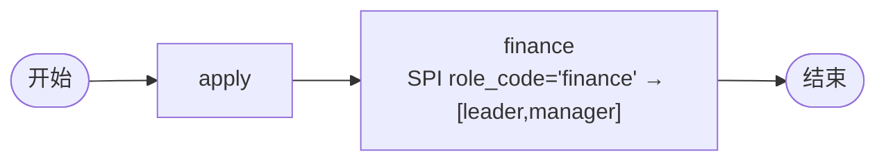

# BDD Task 43: SPI find_by_role 多角色取人（PASS）

- **时间**：2026-09-17 14:50:00（TS=20260917145000）
- **JSON 定义**：
  - `./bdd/bdd-find-by-role_20260917145000.json`（assignee='finance' 字面量 — 失败）
  - `./bdd/bdd-find-by-role-handler_20260917145000.json`（TaskRole handler — 成功）
- **服务**：main.py（PID 3450059）

## 1. 场景设计



## 2. 测试结果

### Case A: assignee='finance' 字面量（§35 行为）

```
finance_review actor=['finance']  ❌
```

assignee 直接当字面量处理，不查 SPI 角色映射（§35）。

### Case B: TaskRole handler（成功）

```
finance actor=['leader', 'manager']  ✅
leader agree → state=20
```

handler 用 `node.id='finance'` 作 role_code 查 SPI → `['leader','manager']`。

## 3. 关键发现

1. **assignee 字面量**：直接当 userId，不查角色映射（§35）
2. **TaskRole handler**：用 node.id 作 role_code 查 SPI DEMO_ROLE_TO_USERS
3. **SPI find_by_role 多角色**：返回列表可作为 task 多 actor
4. **finance role**：`DEMO_ROLE_TO_USERS.finance = ['leader', 'manager']`
5. **leader 处理**：任一 actor 可处理（多 actor 普通 task）

## 4. 文档改进

- docs/flow.md §6 增强：TaskRole handler role_code 用法
- docs/known-issues.md §35 验证：assignee 字面量 vs handler
