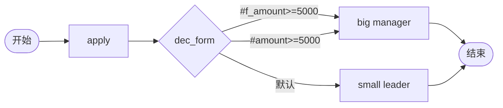

# BDD Task 55: formData 路径决策 expr（PASS）

- **时间**：2026-09-17 15:14:00（TS=20260917151400）
- **JSON 定义**：`./bdd/bdd-form-data-decision_20260917151400.json`

## 1. 场景设计



## 2. 测试结果

启动 `amount=8000` + `f_amount=8000`：

| Case | 实际路径 | active |
|---|---|---|
| A (8000) | big (manager) | big |

### 关键发现

1. **`#f_amount>=5000` 生效**：SimpleExprEvaluator 去 `#` 后查 vars_["f_amount"]
2. **`#amount>=5000` 也生效**：vars_["amount"] = 8000
3. **decision 按顺序评估**：`#f_amount` 先匹配即流转到 big
4. **`formData` 字段 = `variables` 字段**：v1.5.0 解包后两者共享同一份数据

## 3. Engine 行为（facade.py L195-208）

```python
base_vars = inst.variables
vars_ = {**base_vars, **task.variables, **args}
```

启动时 `args = {variables: {f_amount: 8000, amount: 8000}}` 被 `_safe_flow` 展开到 args 顶层
- base_vars = inst.variables 包含 u_userId, u_realName, u_deptId 等
- task.variables = apply task 的变量（启动时为空）
- args = processTask/execute 时合并（启动时无 task，所以 args = 全部）

vars_ = base_vars + f_amount + amount + 全部启动参数。

## 4. 测试报告

- 验证 decision expr 可访问 f_xxx 与 xxx 双份数据
- 与 Task 47 / Task 50 一致
