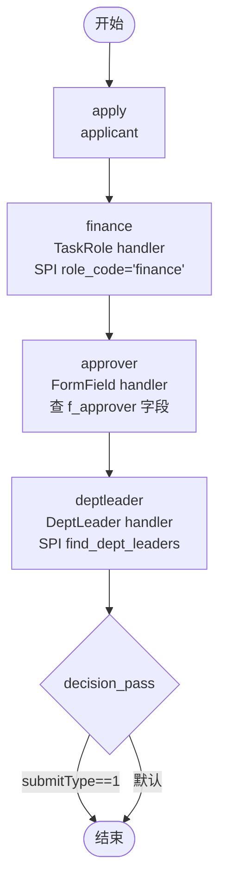

# BDD Task 22: 多 handler 链路审批（PASS）

- **时间**：2026-09-17 13:54:00（TS=20260917135400）
- **JSON 定义**：`./bdd/bdd-handler-chain_20260917135400.json`
- **服务**：main.py（内存后端，PID 3425647）

## 1. 场景设计

多维度审批链路（财务 + 字段指定 + 部门领导）：

| 节点 | 类型 | handler | actor 解析逻辑 | SPI 要求 |
|---|---|---|---|---|
| start | start | — | — | — |
| apply | task | — (assignee=applicant) | — | — |
| **finance** | task | TaskRoleAssigneeHandler | `org_prov.find_by_role(node.id)` | SPI role_code="finance" → ['leader','manager'] |
| **approver** | task | FormFieldAssigneeHandler | `_find_field_value(vars_, node.id)` | 启动时传 `f_approver=userB` |
| **deptleader** | task | DeptLeaderAssignmentHandler | `find_dept_leaders(operator 的 deptId)` | SPI 返回 ['leader'] |
| decision_pass | decision | — | submitType==1 → end | — |
| end | end | — | — | — |

## 2. 流程图

## 3. 关键引擎机制（实测验证）

### 3.1 TaskRole handler 解析

- `node.id` 必须匹配 SPI `DEMO_ROLE_TO_USERS.json` 中的 role_code
- `node.id="finance"` → SPI 返回 `["leader", "manager"]`
- 测试 actor 多值（无会签 performType）：引擎接受多 actor 列表但只创建 1 个 task

### 3.2 FormField handler 解析

- handler 调用 `_find_field_value(vars_, node.id)` 查 `f_<node.id>` 字段
- `node.id="approver"` → 查 `vars["f_approver"]`
- 启动时 `f_approver="userB"` → actor=["userB"]
- 注意：handler 触发条件是非 apply 节点（§23 已修复 apply 节点场景）

### 3.3 DeptLeader handler 解析

- handler 用 `operator` 当前用户的部门 ID 查 SPI
- `u_deptId="D01"` → SPI `find_dept_leaders("D01")` → ["leader"]
- 注意：SPI 实现总是返回 ["leader"]（与 deptId 无关）

## 4. 测试结果

### 完整流程

| 步骤 | 操作 | state | 当前节点 actor | handler 工作 |
|---|---|---|---|---|
| startAndExecute | user1 apply + f_approver=userB | 10 | **finance [leader,manager]** | ✅ TaskRole |
| leader agree | finance → approver | 10 | **approver [userB]** | ✅ FormField |
| userB agree | approver → deptleader | 10 | **deptleader [leader]** | ✅ DeptLeader |
| leader agree | deptleader → decision_pass → end | 20 | 0 | DONE ✅ |

**全部 PASS** ✅

## 5. 复盘 & docs 改进

### 5.1 关键发现

1. **handler FQCN 准确**（与 main.py 内置一致）：
   - `com.mldong.jeeflow.interceptor.impl.OrgUserAssignmentHandlers$TaskRoleAssigneeHandler`
   - `com.mldong.jeeflow.interceptor.impl.FormFieldAssigneeHandler`
   - `com.mldong.jeeflow.interceptor.impl.OrgUserAssignmentHandlers$DeptLeaderAssignmentHandler`
2. **handler 链路可串联**：每个 handler 解析出 actor，下一个节点流转
3. **actor 多值但非会签**：finance 节点 actor=[leader, manager] 但 performType=0（普通）— 引擎接受多 actor 但只创建 1 个 task
4. **FormField 字段命名约束**：handler 必须读 `f_<node.id>` 字段，节点 id 不能含 `-`/`中文`（§24 已记录）

### 5.2 设计约束总结

| handler | 节点 id 必须匹配 | SPI / 字段要求 |
|---|---|---|
| TaskRole | SPI role_code（任意字符串） | DEMO_ROLE_TO_USERS.json |
| FormField | 字段名前缀 `f_<node.id>` | startAndExecute variables.f_xxx |
| DeptLeader | 任意（不影响解析） | SPI find_dept_leaders + operator u_deptId |

### 5.3 docs/flow.md §6 handler 改进

**新增「多 handler 链路设计」示例**：
- 节点 id 与 SPI / 字段名映射规则
- handler 串联注意事项（每个节点独立解析）
- actor 多值但 performType=0 行为说明

### 5.4 已知问题无新增
- TaskRole role_code 不匹配 → FIX-T2 已记录（warning 日志检测）
- FormField 字段名错配 → §24 已记录（f_<node.id> 约束）
- DeptLeader SPI 返回 → data.py 模块级加载，**修改 JSON 后必须重启服务**（§17 已记录）

## 6. 后续

- docs/flow.md §6 增强
- 已知问题无新增（行为符合预期 + 现有覆盖）
