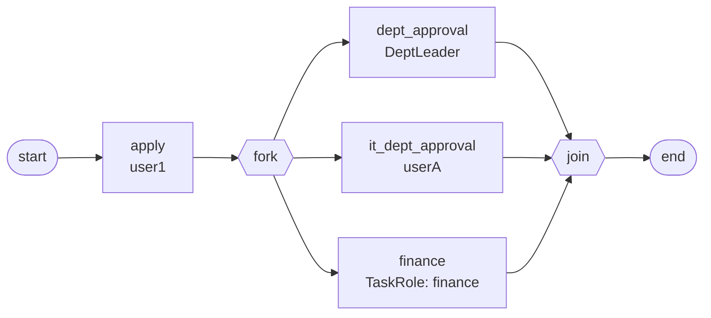

# BDD-IT采购 测试报告

- **测试时间**：2026-09-17 13:54:00（TS=20260917115400）
- **后端**：PG
- **JSON 定义**：`./bdd/bdd-it-procurement_20260917115400.json`
- **状态**：✅ PASS（修复后）

## 1. 流程定义（Mermaid）

节点数：8（含 start/end），边数：9

## 2. 测试结果

| 测试 | 描述 | state | 结果 |
|---|---|---|---|
| 主流程 | user1 申请 → fork 三方审批 → join → end | 20 | ✅ |

3 个并行 task：
- dept_approval (leader, DeptLeader handler)
- it_dept_approval (userA)
- finance (leader + manager 任一执行，TaskRole handler role=finance)

## 3. 复盘与发现

### 3.1 新发现 ⚠️ handler 失败导致 fork 分支静默通过

**初版设计** finance_approval 节点用 TaskRoleAssigneeHandler，node.id="finance_approval" → SPI 无此 role → handler 返回 []。

**实测行为**：
- `_create_task` line 379 `if not actors: return` → **不创建 task**
- 但 fork 遍历时该节点已被 `_execute_node` 触发（进入 `_create_task` 然后 return）
- `processInstance/highLight` historyNodeNames 包含 `finance_approval`
- `activeTaskList` 中**没有** finance_approval task
- join 检查 `find_doing_tasks` → 剩余 leader/userA 两个 task 完成 → join → end → state=20

**问题**：财务审批**从未真正执行**，流程直接流转 end。**业务上视为非法通过**。

### 3.2 修复

将节点 id 从 `finance_approval` 改为 `finance`（命中 SPI `DEMO_ROLE_TO_USERS.json` 的 `finance: [leader, manager]`）→ 修复 PASS。

### 3.3 改进建议

- §known-issues 新增 §26 — handler 失败导致 fork 分支静默通过（业务安全风险）
- 引擎层：handler 返回 [] 时应记录 warning 日志，提示节点被跳过
- fork 节点应记录"未激活分支"，join 时若存在未激活分支应拒绝流转
