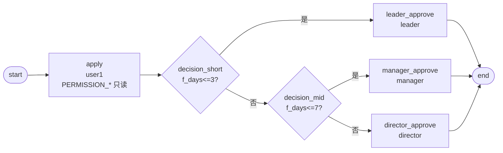

# BDD-请假申请 测试报告

- **测试时间**：2026-09-17 13:50:00（TS=20260917115000）
- **后端**：PG（DSN `10.17.1.26:6432`）
- **JSON 定义**：`./bdd/bdd-leave-approval_20260917115000.json`
- **状态**：✅ 3/3 PASS

## 1. 流程定义（Mermaid）



节点数：8（含 start/end），边数：9

## 2. 测试结果

| 测试 | f_days | 决策路径 | 最终审批人 | state | 结果 |
|---|---|---|---|---|---|
| A | 2 | decision_short → leader | leader | 20 | ✅ |
| B | 5 | decision_short → decision_mid → manager | manager | 20 | ✅ |
| C | 10 | decision_short → decision_mid → director | director | 20 | ✅ |

### 详细任务列表（Test C days=10）

```
state=20 (DONE)
  apply            state=20 actorIds=['user1']
  director_approve state=20 actorIds=['director']
```

## 3. 复盘

### 3.1 关键技术点

1. **decision 多级嵌套**：SimpleExprEvaluator regex 不支持 `&&`（`^\s*(#?\w+)\s*(>=|<=|!=|==|>|<)\s*(\d+(?:\.\d+)?)\s*$`），所以把"4-7天"区间拆成两级 decision + 兜底边：
   - `decision_short.f_days<=3` → leader / `f_days>3` → 下一级 decision_mid
   - `decision_mid.f_days<=7` → manager / `f_days>7` → director
2. **PERMISSION_* 字段权限**：apply 节点 PERMISSION_f_leaveType/days/reason/fromDate/toDate=1（只读），保证审批人看得到但不允许改
3. **审批节点按层级递增**：≤3天组长，4-7天经理，>7天总监——三层组织架构真实映射

### 3.2 引擎观察

- ✅ decision 顺序评估正确，首个真值即流转
- ✅ 决策节点表达式变量从 `variables.f_days` 取值（顶层，非嵌套）
- ✅ PERMISSION_* 字段回写 `bizData` 时保留只读语义

### 3.3 改进建议

- docs/flow.md §3.4 decision 章节可补充「多级 decision 嵌套示例」（当前仅展示单级 expr）
- AGENTS.md §7 反模式表可加一条：「不要在 decision expr 写 `&&` / `||` 复合条件，应拆成多级 decision」
