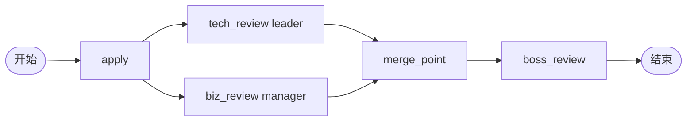

# BDD Task 29: 多分支并行审批 + 汇聚（PASS）

- **时间**：2026-09-17 14:17:00（TS=20260917141700）
- **JSON 定义**：
  - `./bdd/bdd-multi-branch-merge_20260917141700.json`（snaker:custom — 失败）
  - `./bdd/bdd-multi-branch-merge-join_20260917141700.json`（snaker:join — 成功）
- **服务**：main.py（PID 3440125）

## 1. 场景设计

2 条并行审批分支 + 汇聚节点：



## 2. 测试结果

### Case A: snaker:custom（**失败**）

merge_point 用 `snaker:custom` 类型 → 引擎调 `_create_task`，但无 assignee → actors=[] → 不创建 task → boss_review 永远不创建 ❌

### Case B: snaker:join（**成功**）

merge_point 改 `snaker:join` 类型 → 引擎 `_execute_node` TYPE_JOIN 分支：

```python
if node.type == TYPE_JOIN:
    if not await self.repo.find_doing_tasks(inst.id):
        for n in _follow_edges(flow, node.id): 
            await self._execute_node(...)
```

**所有前驱 DONE 才推进** ✅

| 步骤 | 操作 | active | state |
|---|---|---|---|
| startAndExecute | user1 | tech+biz | 10 |
| leader agree | tech DONE | biz | 10 |
| manager agree | biz DONE | boss (通过 merge_point) | 10 |
| boss agree | boss DONE | 0 | **20** |

历史：`['apply', 'tech_review', 'biz_review', 'boss_review', 'merge_point', 'end']`

## 3. 关键发现

1. **snaker:custom 不能用作 join 节点**（会当作 task 节点创建 task）
2. **snaker:join 才是 join 节点**（snaker:join + TYPE_JOIN）
3. **JOIN 语义**：所有前驱 DONE → 推进（JOIN_ALL）
4. **merge_point 不创建 task**：它是路由节点，不会出现在 tasks[] 中
5. **history 顺序**：包含 merge_point 但顺序不严格（snaker join 节点特性）

## 4. 文档改进

- docs/known-issues.md §44 新增：snaker:custom vs snaker:join 区别
- docs/flow.md §3.5 新增：汇聚节点必须用 snaker:join
