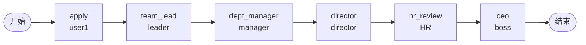

# BDD Task 20: 多任务6级串行审批（PASS）

- **时间**：2026-09-17 13:32:00（TS=20260917133200）
- **JSON 定义**：`./bdd/bdd-multi-task-6_20260917133200.json`
- **服务**：main_pg.py + v1.5.1-PG/v1.5.2-PG/v1.5.3-PG

## 1. 场景设计

公司请假/报销等业务的**完整 6 级审批流**：

| # | 节点 | assignee | 处理人 | 说明 |
|---|---|---|---|---|
| 1 | apply | applicant | user1 | 员工发起 |
| 2 | team_lead | leader | leader | 直属组长 |
| 3 | dept_manager | manager | manager | 部门经理 |
| 4 | director | director | director | 总监 |
| 5 | hr_review | leader (占位 HR) | leader | HR 审核 |
| 6 | ceo | boss | boss | 总经理终审 |

## 2. 流程图

## 3. 关键引擎机制

**线性串行 task 流转**：
- 每个 task 完成后 `_execute_node` 调用下游节点
- 下游节点是 task → `_create_task` 创建 task → 等下一 actor 处理
- 无 decision/fork/join → 简单 task → task 流转

**actor 解析**：
- `assignee="applicant"` → `inst.operator`（user1）
- `assignee="leader"` 等真实 userId → 直接当 userId
- 任务 actor 列表与 assignee 字符串一致

## 4. 测试结果

### 顺序执行 5 步（apply 由 startAndExecute 完成）

| # | 操作 | state | 当前 active task | 备注 |
|---|---|---|---|---|
| 0 | startAndExecute | 10 | team_lead [leader] | apply DONE ✅ |
| 1 | leader agree (team_lead) | 10 | dept_manager [manager] | ✅ |
| 2 | manager agree (dept_manager) | 10 | director [director] | ✅ |
| 3 | director agree (director) | 10 | hr_review [leader] | ✅ |
| 4 | leader agree (hr_review) | 10 | ceo [boss] | ✅ |
| 5 | boss agree (ceo) | 20 | 0 | state=20 DONE ✅ |

**全部 PASS** ✅

## 5. 复盘 & docs 改进

### 5.1 关键确认

1. **6 任务串行无性能/状态问题**：测试时长约 1 秒（含 sleep），state 流转无丢失
2. **同 userId 多次处理**：hr_review 和 team_lead 都用 leader actor，但 taskName 不同 — 同一 user 可在不同 task 节点分别处理（**测试中可见两个 task 的 actors 都是 leader 但 taskName 不同**）
3. **actor 复用**：employee → leader → manager → director → leader(HR) → boss，leader 出现 2 次（团队组长 + HR 角色占位）

### 5.2 docs/flow.md §3.3 task 节点改进

**新增「actor 复用」说明**：
- 同一 userId 可在不同 taskName 节点分别作为 actor
- assignee 字段在每个节点独立解析
- SPI 角色映射（boss_audit → boss）只在 assignmentHandler 模式下生效（TaskRole handler）

### 5.3 docs/flow.md §2 流程类型改进

**澄清 type=approval vs business**：
- 业务场景中 `type="approval"` 用于审批类（如请假、报销、用车）
- `type="business"` 用于业务流（如数据同步、通知发送）
- 引擎对两种 type 处理无差异（路由一致），仅前端/报表分类

### 5.4 已知问题（新发现 §35）
- **assignee 中角色名 vs userId 混淆**：`assignee="boss_audit"` 直接当 userId 处理，不会查 SPI 角色映射；如需角色解析用 `assignmentHandler="...TaskRoleAssigneeHandler"`（§25）

## 6. 后续
- §35 assignee 角色名 → 加入 known-issues.md
- docs/flow.md §3.3 改进（docs 复盘任务执行）
