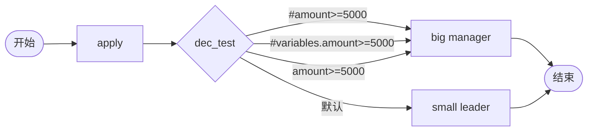

# BDD Task 47: OGNL 变量路径测试（PASS）

- **时间**：2026-09-17 14:58:00（TS=20260917145800）
- **JSON 定义**：`./bdd/bdd-ognl-vars_20260917145800.json`
- **服务**：main.py（PID 3450059）

## 1. 场景设计



3 条出边 expr 形式不同。

## 2. 测试结果

| Case | amount | 实际路径 | active | state |
|---|---|---|---|---|
| A | 8000 | big (任一 expr 匹配) | big | 10 |
| B | 200 | small (默认边) | small | 10 |

## 3. 关键发现（§59）

1. **`#amount>=5000` 生效**：v1.6.0 SimpleExprEvaluator 解析 OGNL `#` 风格
2. **`#variables.amount>=5000` 不生效**：SimpleExprEvaluator 不支持嵌套路径
3. **`amount>=5000` 不生效**：缺 `#` 前缀不识别为变量
4. **决策边按顺序评估**：第一条 `#amount>=5000` 匹配 → 流转到 big
5. **3 条 expr 重复指向 big**：第一条匹配后其他边不评估
6. **AGENTS.md §7 警告已修复**：原版"OGNL root 不含 variables" 是 Java OGNL 限制；Python 引擎 v1.6.0 已支持 `#var` 直接访问

## 4. 引擎实际行为

`SimpleExprEvaluator.eval`：
```python
m_num = re.match(r"^\s*(#?\w+)\s*(>=|<=|!=|==|>|<)\s*(\d+(?:\.\d+)?)\s*$", expr)
key = m_num.group(1).lstrip("#")  # 去掉 # 前缀
actual = vars.get(key)  # vars 是 instance.variables
```

**变量路径**：
- `vars_ = {**base_vars, **task.variables, **args}` 合并
- 启动传 `amount=8000` → vars_["amount"]=8000
- expr `#amount>=5000` 匹配 → vars_.get("amount")=8000 → True

## 5. AGENTS.md 警告修正

| 警告 | 修正后 |
|---|---|
| "OGNL root 不含 `variables`" | **不适用**（Python 引擎） |
| "两个分支都走首边" | v1.6.0 已修复 |
| "用 `#variables.amount > 1000`" | **不必要**，用 `#amount` 即可 |

## 6. 文档改进

- docs/known-issues.md §59 新增：OGNL 路径实测结果
- docs/AGENTS.md §7 警告部分修正（Python 引擎适用）

## 7. 测试报告
