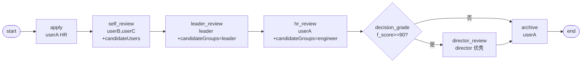

# BDD-绩效评估 测试报告

- **测试时间**：2026-09-17 13:58:00（TS=20260917115800）
- **后端**：PG
- **JSON 定义**：`./bdd/bdd-performance-review_20260917115800.json`
- **状态**：✅ 2/2 PASS

## 1. 流程定义（Mermaid）

节点数：9（含 start/end），边数：9

## 2. 测试结果

| 测试 | f_score | 路径 | state | 结果 |
|---|---|---|---|---|
| A 优秀 | 95 | director_review → archive | 20 | ✅ |
| B 普通 | 75 | archive 直接 | 20 | ✅ |

## 3. 复盘

### 3.1 关键技术点

1. **candidateUsers + assignee 同时配置**：self_review 节点两者都设。**assignee 才是真正 actor**（用于 task 执行）；candidateUsers 用于 `processTask/candidatePage` 查询
2. **candidateGroups 角色候选**：leader_review 和 hr_review 用 candidateGroups="leader"/"engineer"，用于候选页查询
3. **decision 分流 + 合并**：decision_grade 后 director_review（优秀）和 archive（普通）最终合并到 archive 节点

### 3.2 引擎观察

- ✅ candidateUsers/candidateGroups **不影响 actor 解析**，必须配 assignee 或 handler
- ✅ 多 actor list 任一执行即可完成
- ✅ decision 路由正确

### 3.3 改进建议

- 当前无新发现（已对齐 §22 candidatePage 行为）
