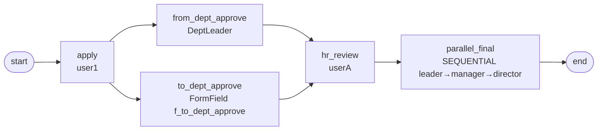

# BDD-调岗申请 测试报告

- **测试时间**：2026-09-17 13:59:00（TS=20260917115900）
- **后端**：PG
- **JSON 定义**：`./bdd/bdd-position-transfer_20260917115900.json`
- **状态**：✅ PASS（修复后）

## 1. 流程定义（Mermaid）



节点数：7（含 start/end），边数：7

## 2. 测试结果

| 测试 | 路径 | state | 结果 |
|---|---|---|---|
| A 调岗 | apply → 2 并行 → hr → 3级串行 → end | 20 | ✅ |

完整 task 列表（含重复）：
```
apply           state=20 actors=['user1']
from_dept_approve state=20 actors=['leader']
to_dept_approve state=20 actors=['manager']
hr_review state=20 actors=['userA']   ← 第 1 个
hr_review state=20 actors=['userA']   ← 第 2 个（双入边重复）
parallel_final state=20 actors=['leader'] ← 第 1 个
parallel_final state=20 actors=['leader'] ← 重复
parallel_final state=20 actors=['manager']
parallel_final state=20 actors=['director']
```

## 3. 复盘与发现

### 3.1 新发现 ⚠️ 多入边 task 节点重复创建 task

**根因**：hr_review 有 2 个入边（from_dept + to_dept），每次 _execute_node 触发都会创建新 task。同样，parallel_final 也被 2 个 hr_review task 入边重复触发。

**影响**：
- 同一节点需执行 N 次（N=入边数）
- SEQUENTIAL 会签 + 多入边叠加，导致 initial 创建多余 task

**业务影响**：HR 需审批同一节点 2 次；用户操作翻倍。

**详细分析**：见 `docs/known-issues.md §27`

### 3.2 关键技术点

1. **SEQUENTIAL 串行会签**：leader→manager→director 顺序流转，每个 member 独立 task
2. **FormField handler 应用在中间节点**：to_dept_approve 用 FormFieldAssigneeHandler，字段名 `f_to_dept_approve="manager"`
3. **DeptLeader handler 应用**：from_dept_approve 用 DeptLeaderAssignmentHandler 自动取发起人部门领导

### 3.3 改进建议

- **设计时**：避免多入边汇合到 task 节点，改用 join 或单一入边
- 引擎层：节点首次创建 task 后，后续入边激活应跳过创建（§27）
