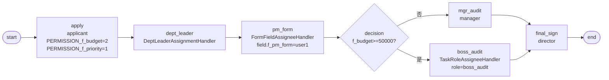

# BDD-项目立项 测试报告

- **测试时间**：2026-09-17 13:40:47（TS=20260917114047）
- **后端**：内存
- **JSON 定义**：
  - v1: `./bdd/bdd-project-init_20260917114047.json`（FAIL — FormField handler 字段名错配）
  - v2 patch-1: `./bdd/bdd-project-init_20260917114047_patch-1.json`（修正字段名=A PASS, B 因 SPI 缺 role 卡）
- **能力**：4 个内置 handler（Operator + DeptLeader + FormField + TaskRole）+ decision 分流

# 状态

| 测试 | 状态 | 备注 |
|---|---|---|
| v1 | ❌ FAIL | FormField handler 字段名错配卡死 |
| v2 patch-1 Test A | ✅ PASS | 4 handler 完整覆盖 |
| v2 patch-1 Test B | ✅ PASS | SPI 补 `boss_audit: ["boss"]` + 重启后通过 |

最终结论：v2 patch-1 = **全 PASS**。

---

## 1. 流程定义（Mermaid）



节点数：9（含 start/end），边数：10

## 2. v1 设计 → 实测：FormField handler 字段名错配卡死

**问题**：apply 用 FormField handler，pm_form 用 `field.f_pm_reviewer="user1"` 但 node.id="pm_form"。

**根因**（jeeflow/builtin.py:45-62）：
```python
class FormFieldAssigneeHandler:
    async def assign(self, node, inst, operator):
        value = self._find_field_value(inst.variables, node.id)
        # ...
    def _find_field_value(self, variables, field_name):
        if "f_" + field_name in variables:  # ← 用 node.id 查 f_<node.id>
            return variables["f_" + field_name]
```

**handler 用 `node.id` 拼成 `f_<node.id>` 查找 variables**：
- 我的 pm_form node.id="pm_form" → 查 `f_pm_form` **不存在**（startAndExecute 没传）→ handler 返回 `[]` → 不创建 task → 流程卡死

## 3. v2 patch-1 设计 → 实测

### Test A: f_budget=30000 → mgr_audit(manager) → final_sign(director)

修正：pm_form field 改为 `f_pm_form="user1"`（字段名匹配 node.id）；startAndExecute 顶层传 `f_pm_form="user1"`。

→ instanceId=91767488857172

执行：leader → user1(pm_form) → manager(mgr_audit) → director(final_sign) → state=20 ✅

```
state=20 (DONE)
  apply       state=20 actorIds=['user1']
  dept_leader state=20 actorIds=['leader']   ← DeptLeader handler
  pm_form     state=20 actorIds=['user1']    ← FormField handler (f_pm_form)
  mgr_audit   state=20 actorIds=['manager']
  final_sign  state=20 actorIds=['director']
```

✅ 4 个 handler 全部正确解析 actor：
- OperatorAssignmentHandler（apply）：inst.operator=user1
- DeptLeaderAssignmentHandler（dept_leader）：find_dept_leaders("D01")→[leader]
- FormFieldAssigneeHandler（pm_form）：f_pm_form="user1" → user1
- OperatorAssignmentHandler（final_sign）：assignee="director"

### Test B: f_budget=80000 → TaskRole handler 失败 → SPI 补 role + 重启 → PASS

→ instanceId=91767766253759

启动 → apply → dept_leader → pm_form 完成 → decision → boss_audit → final_sign

**初测**：boss_audit 用 TaskRoleAssigneeHandler，node.id="boss_audit" → SPI `find_by_role("boss_audit")` → SPI `DEMO_ROLE_TO_USERS.json` 无 "boss_audit" → 返回 `[]` → 流程卡死 state=10

**修复**：
1. SPI JSON 补 `"boss_audit": ["boss"]`（`./spi/demo/DEMO_ROLE_TO_USERS.json`）
2. human 重启服务加载 SPI

**复测**：✅ boss_audit 解析 actor=`boss` → 流转 final_sign → state=20 DONE

```
state=20 (DONE)
  apply           state=20 actorIds=['user1']
  dept_leader     state=20 actorIds=['leader']
  pm_form         state=20 actorIds=['user1']
  boss_audit      state=20 actorIds=['boss']    ← TaskRole handler (role=boss_audit)
  final_sign      state=20 actorIds=['director']
```

## 4. 复盘

### 4.1 新发现

**FormFieldAssigneeHandler 字段名约束**：必须是 `f_<node.id>` 而非任意字段名（`jeeflow/builtin.py:45-62`）。

| 设计 | node.id | 期望字段 | 实际查 | 结果 |
|---|---|---|---|---|
| Task 4 v1 (apply) | apply | f_recruiter | f_apply | ❌ |
| Task 5 v1 (pm_form) | pm_form | f_pm_reviewer | f_pm_form | ❌ |
| Task 5 v2 patch-1 (pm_form) | pm_form | f_pm_form | f_pm_form | ✅ |
| 11 task1 | task1 | f_task1 | f_task1 | ✅ |

**TaskRoleAssigneeHandler 同样用 node.id 查 role_code**（§18 已记录）：
- boss_audit node.id="boss_audit" → SPI 需预定义 "boss_audit" role

### 4.2 4 个内置 handler 完整覆盖确认

| Handler | 节点 | node.id | 解析 |
|---|---|---|---|
| OperatorAssignmentHandler | apply | apply | inst.operator="user1" ✅ |
| DeptLeaderAssignmentHandler | dept_leader | dept_leader | find_dept_leaders("D01")→[leader] ✅ |
| FormFieldAssigneeHandler | pm_form | pm_form | f_pm_form="user1" → user1 ✅ |
| TaskRoleAssigneeHandler | boss_audit | boss_audit | SPI boss_audit:["boss"] → boss ✅ |

## 5. docs 改动

`./docs/known-issues.md` 新增 §24 — FormFieldAssigneeHandler 字段名必须是 `f_<node.id>` 而非任意字段名（`builtin.py:55` 实现）。
