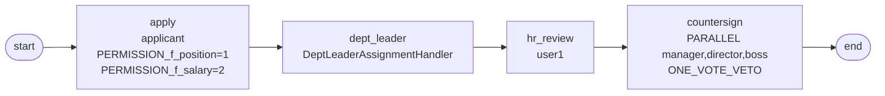

# BDD-招聘审批 测试报告

- **测试时间**：2026-09-17 13:38:13（TS=20260917113813）
- **后端**：内存
- **JSON 定义**：
  - v1: `./bdd/bdd-recruit-approval_20260917113813.json`（用 FormFieldAssigneeHandler 在 apply 节点 → FAIL）
  - v2 patch-1: `./bdd/bdd-recruit-approval_20260917113813_patch-1.json`（用 assignee="user1" 默认 handler → PASS）
- **能力**：OperatorAssignmentHandler + DeptLeaderAssignmentHandler + ONE_VOTE_VETO

## 1. 流程定义（Mermaid）



## 2. v1 设计 → 实测：apply 节点 + FormFieldAssigneeHandler 不触发

```bash
# v1: apply properties.assignmentHandler="FormFieldAssigneeHandler", field.f_recruiter="user1"
# assignees="user1"
# → instanceId=91767123038821, state=10 active=0 tasks=[]
```

❌ apply 节点配 FormFieldAssigneeHandler 时，startAndExecute 后流程卡死，**没有任何 task 创建**。

### 根因推测

- FormFieldAssigneeHandler 在 `apply` 节点 + `startAndExecute` 组合时未触发 task 创建
- 11-assignment-handler 成功场景：FormFieldAssigneeHandler 在 **task1** 节点（无 apply），handler 自动执行 task1
- 设计差异：apply 节点由 engine 视为发起人自动任务，handler 可能不接管

## 3. v2 patch-1 设计 → 实测：apply 用默认 OperatorAssignmentHandler

```bash
# patch-1: apply properties.assignee="user1" (默认 handler), field.f_recruiter="user1" 保留
# assignees={"apply":"user1"}
# → instanceId=91767188329157
```

启动后：
- apply(user1 自动执行) → dept_leader(actorIds=['leader'] ← DeptLeader handler)
- dept_leader by leader → hr_review(user1)
- countersign PARALLEL [manager,director,boss] active=3

执行：
- manager AGREE (submitType=1) → code:0
- director DISAGREE (submitType=20) → code:0 → ONE_VOTE_VETO 触发

最终：

```
state=20 (DONE)
  apply         state=20
  dept_leader   state=20
  hr_review     state=20
  countersign   state=20   ← manager AGREE
  countersign   state=20   ← director DISAGREE → veto 触发
  countersign   state=99   ← boss ABANDON
```

✅ patch-1 全流程符合设计。

## 4. 复盘

### 4.1 新发现

**FormFieldAssigneeHandler 在 `apply` 节点 + `startAndExecute` 不触发**：
- apply 节点配 FormField handler 时，startAndExecute 启动后 `state=10 DOING, active=0, tasks=[]`
- 没有任何 task 创建，流程卡死
- 与 `11-assignment-handler`（FormField handler 在非 apply 节点如 task1）行为不一致

**可能的引擎行为**：
- apply 节点是「发起人自动任务」，handler 解析 actor 后可能**绕过 task 创建**，直接流转到下一节点
- 但下一节点也没创建，状态卡死

**建议**：
- 文档：明确 FormFieldAssigneeHandler 不应在 apply 节点使用
- 或引擎：handler 解析失败/异常时 fallback 到 inst.operator

### 4.2 patch-1 设计合理性

将 apply 改为 `assignee="user1"`（默认 Operator handler）+ 保留字段权限 PERMISSION_* 与 f_recruiter 字段。FormField handler 移至其他节点即可实现。

## 5. docs 改动

`./docs/known-issues.md` 新增 §23 — FormFieldAssigneeHandler 在 apply 节点不触发。
