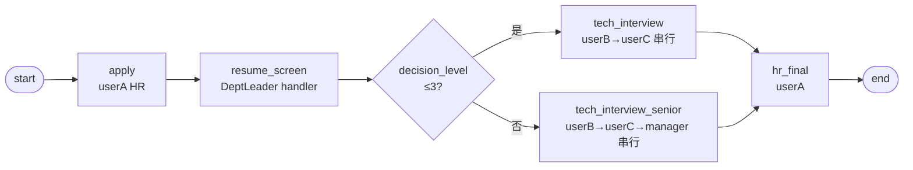

# BDD-技术招聘 测试报告

- **测试时间**：2026-09-17 13:53:00（TS=20260917115300）
- **后端**：PG
- **JSON 定义**：`./bdd/bdd-recruit-tech_20260917115300.json`
- **状态**：✅ 2/2 PASS

## 1. 流程定义（Mermaid）

节点数：8（含 start/end），边数：8

## 2. 测试结果

| 测试 | f_level | 路径 | 串行成员 | state | 结果 |
|---|---|---|---|---|---|
| A 初级 | 2 | tech_interview | userB → userC | 20 | ✅ |
| B 高级 | 5 | tech_interview_senior | userB → userC → manager | 20 | ✅ |

## 3. 复盘

### 3.1 关键技术点

1. **串行会签 SEQUENTIAL**：performType=1 + countersignType=SEQUENTIAL；assignee "userB,userC" 按顺序逐个创建 task，每人独立 execute
2. **职级 decision 分流**：≤3 初级（2 人会签），>3 高级（3 人会签，含 manager）
3. **DeptLeader handler**：筛选节点用部门领导解析 actor

### 3.2 引擎观察

- ✅ SEQUENTIAL 串行正确：每个 assignee 创建独立 task，按序 execute 后流转
- ✅ candidateUsers 字段在串行会签时冗余（不影响 actor 解析，但确保 candidatePage 列出）
- ✅ decision 分流后 hr_final 节点合并

### 3.3 改进建议

- 当前无新发现
