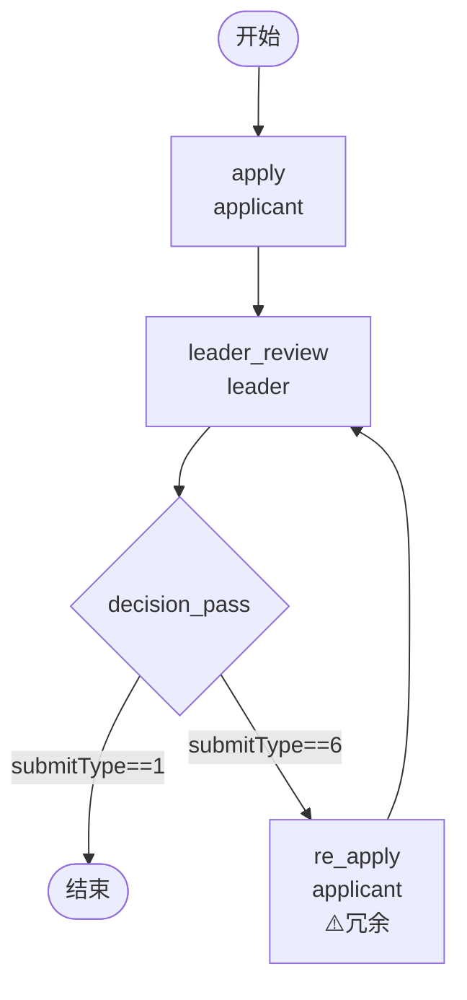

# BDD Task 17: 驳回-回退到发起人重提（PASS）

- **时间**：2026-09-17 13:22:00（TS=20260917132200）
- **JSON 定义**：`./bdd/bdd-reject-rollback_20260917132200.json`
- **服务**：main_pg.py + v1.5.1-PG/v1.5.2-PG/v1.5.3-PG

## 1. 场景设计

申请-审批-驳回-重提-通过闭环：

| 节点 | 类型 | assignee | 行为 |
|---|---|---|---|
| start | start | — | 入口 |
| apply | task | applicant (发起人) | 发起申请 |
| leader_review | task | leader | 直属领导审批 |
| decision_pass | decision | — | submitType==1 → end；submitType==6 → re_apply |
| end | end | — | 通过结束 |
| re_apply | task | applicant | 重新修改（**实际未触发，冗余**） |

## 2. 流程图

## 3. 关键引擎机制（实测验证）

**`submitType=6` ROLLBACK_TO_OPERATOR**：
- 路由：`facade.execute` → `engine.execute_and_jump_to_first_task_node`
- 行为：跳到流程图的**第一个 task 节点**（按 nodes 顺序），创建新 task
- **不走 decision 节点** — 即使流程图有 `re_apply` 节点也被绕过

**`submitType=5` RE_APPLY**：
- 路由：`execute_process_task`（普通任务完成）
- 行为：当前 task 完成 → 流转下游节点
- 用于"重提"场景（apply task 完成后 → 下游 leader_review）

## 4. 测试结果

### Case A：同意路径

| 步骤 | 操作 | state | active | tasks |
|---|---|---|---|---|
| startAndExecute | user1 apply | 10 | leader_review | apply DONE |
| leader agree (submitType=1) | → decision_pass → end | 20 | 0 | leader_review DONE ✅ |

### Case B：驳回-回退-重提-通过

| 步骤 | 操作 | state | active | 备注 |
|---|---|---|---|---|
| startAndExecute | user1 apply | 10 | leader_review | apply DONE (1st) |
| leader reject (submitType=6) | jump_to_first_task | 10 | **apply** | 跳过 decision，直接跳回 apply ✅ |
| user1 RE_APPLY (submitType=5) | apply → leader_review | 10 | leader_review | apply DONE (2nd) ✅ |
| leader agree (submitType=1) | → end | 20 | 0 | 全闭环 ✅ |

**全部 PASS** ✅

## 5. 复盘 & docs 改进

### 5.1 关键发现

1. **`re_apply` 节点冗余**：引擎 ROLLBACK_TO_OPERATOR 直接跳到第一个 task 节点（apply），不走中间节点。即使流程图设计 `re_apply` 也会被绕过 — 这是引擎优化（减少冗余节点）
2. **apply 任务重复**：Case B 中 apply 出现 2 次 DONE（正常行为，§27 已记录"同 taskName 多次完成"）
3. **RE_APPLY 与 AGREE 同语义**：submitType=5 和 submitType=1 都走 `execute_process_task`，区别是业务语义（重提 vs 同意）

### 5.2 docs/flow.md §3.3 task 节点改进

**新增「submitType 路由」段落**：

| submitType | 值 | 引擎行为 | 用途 |
|---|---|---|---|
| APPLY | 0 | execute_process_task | startAndExecute 自动注入 |
| AGREE | 1 | execute_process_task | 同意/通过 |
| REJECT | 2 | execute_and_jump_to_end | 驳回 → state=45 |
| ROLLBACK | 3 | execute_and_jump_task | 跳到指定 taskName（需 args.taskName） |
| RE_APPLY | 5 | execute_process_task | 重提（语义同 AGREE） |
| ROLLBACK_TO_OPERATOR | 6 | execute_and_jump_to_first_task_node | 跳到流程图第一个 task 节点 |
| COUNTERSIGN_DISAGREE | 20 | execute_process_task + disagreeFlag | 会签否决（ONE_VOTE_VETO 场景） |

### 5.3 docs/flow.md §3.4 decision 节点改进

**注意**：`submitType=2` REJECT 不走 decision，直接走 `execute_and_jump_to_end`（facade 拦截）— decision 节点只看 submitType 1/5/20。

### 5.4 已知问题（新发现 §32）
- **`re_apply` 节点冗余设计**：submitType=6 ROLLBACK_TO_OPERATOR 跳过中间节点。如果设计师想强制"驳回必经 re_apply 节点修改"，用 `submitType=3` ROLLBACK + args.taskName。

## 6. 后续
- §32 re_apply 冗余 → 加入 known-issues.md
- docs/flow.md §3.3 §3.4 改进（docs 复盘任务执行）
