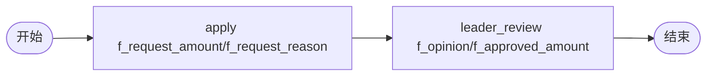

# BDD Task 38: 任务变量 vs 实例变量（PASS）

- **时间**：2026-09-17 14:40:00（TS=20260917144000）
- **JSON 定义**：`./bdd/bdd-task-vs-instance-var_20260917144000.json`
- **服务**：main.py（PID 3446706）

## 1. 场景设计

申请金额 + 原因 → 领导审批意见 + 批准金额。

## 2. 测试结果

| 步骤 | 操作 | formData | instance.variable |
|---|---|---|---|
| startAndExecute | user1 + f_request_amount=5000 | {f_request_amount:5000, f_request_reason:"差旅费报销"} | (已解包) |
| leader approve | taskVariables={f_opinion:"批准", f_approved_amount:4800} | +{f_opinion:"批准", f_approved_amount:4800} | **不变** |

state=20 ✅

## 3. 关键发现

1. **formData 字段**：实例级表单数据，含 f_xxx + xxx（v1.5.0 wrapper 解包）
2. **taskVariables**：execute 时传的 task 级变量，**只写入 formData**，**不注入 instance.variables**
3. **字段命名双重存在**：`f_request_amount=5000` + `request_amount=5000` 都在 formData 中
4. **instance.variables 与 formData 分离**：startAndExecute variables → instance.variables；execute taskVariables → formData
5. **task detail formKey**：节点 form 字段传给前端作为表单 key

## 4. 文档改进

- docs/known-issues.md §54 新增：taskVariables 不注入 instance.variables
- docs/flow.md §2 增强：instance.variables vs formData vs taskVariables 区别
