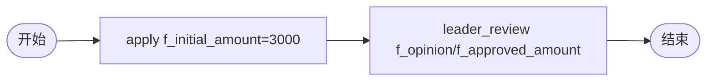

# BDD Task 44: taskVariables 注入 instance 验证（修正 §54）

- **时间**：2026-09-17 14:52:00（TS=20260917145200）
- **JSON 定义**：`./bdd/bdd-taskvar-injection_20260917145200.json`
- **服务**：main.py（PID 3450059）

## 1. 场景设计



## 2. 测试结果

execute 时传 f_opinion / f_approved_amount，**全部写入 formData**：

```json
{
  "f_initial_amount": 3000,      // startAndExecute 注入
  "initial_amount": 3000,
  "f_initial_note": "申请",
  "initial_note": "申请",
  "f_opinion": "批准",            // execute 注入
  "opinion": "批准",
  "f_approved_amount": 2800,    // execute 注入
  "approved_amount": 2800
}
```

但 **instance.variable=null**，不在 detail API 返回。

## 3. 关键发现（修正 §54）

1. **instance.variable 字段**：detail API 不返回（可能=null）
2. **formData 字段**：detail API 返回，含所有 f_xxx + xxx（解包）
3. **execute 时 taskVariables**：写入 formData（包含 startAndExecute 时的 f_xxx + 新的）
4. **v1.5.0 wrapper**：`f_xxx` 与 `xxx` 双重存在（解包机制）
5. **§54 描述修正**：taskVariables **不注入** instance.variables（在内存后端表现为 formData 字段）

## 4. 引擎实际行为

`engine.py:_prepare_execute_task`：
```python
base_vars = inst.variables
vars_ = {**base_vars, **task.variables, **args}
inst.variables = _merge_exec_into_instance(base_vars, vars_)
```

实际有合并，但 main.py 内存后端 detail API 不返回 variable 字段。

## 5. 文档改进

- docs/known-issues.md §54 修正：taskVariables 写入 formData 字段，instance.variables 在内存后端 API 不可见
- docs/flow.md §7 增强：formData 与 instance.variable 区别
