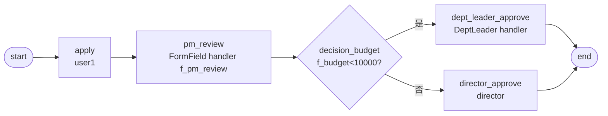

# BDD-培训申请 测试报告

- **测试时间**：2026-09-17 13:55:00（TS=20260917115500）
- **后端**：PG
- **JSON 定义**：`./bdd/bdd-training-approval_20260917115500.json`
- **状态**：✅ 2/2 PASS

## 1. 流程定义（Mermaid）

节点数：7（含 start/end），边数：7

## 2. 测试结果

| 测试 | f_budget | 路径 | 最终审批人 | state | 结果 |
|---|---|---|---|---|---|
| A 小额 | 5000 | dept_leader_approve | leader | 20 | ✅ |
| B 大额 | 20000 | director_approve | director | 20 | ✅ |

## 3. 复盘

### 3.1 关键技术点

1. **FormField handler 应用在中间节点**：pm_review 节点用 FormFieldAssigneeHandler 查 `f_pm_review="user1"` 变量（节点 id = "pm_review"，字段名 = `f_<node.id>`）
2. **变量必须顶层传入**：startAndExecute 必须传 `f_pm_review="user1"`，否则 handler 返回 [] 卡死（§24）
3. **Handler + 字段映射混用**：pm_review（FormField）→ dept_leader（DeptLeader）→ director（显式 assignee）

### 3.2 引擎观察

- ✅ FormField handler 在中间节点（非 apply）正常触发（§23 已修复 apply 节点场景）
- ✅ 决策分支按预算正确分流
- ✅ 三种 handler 类型在单一流程中共存无冲突

### 3.3 改进建议

- 当前无新发现（已对齐 §24 FormField 字段名约束）
