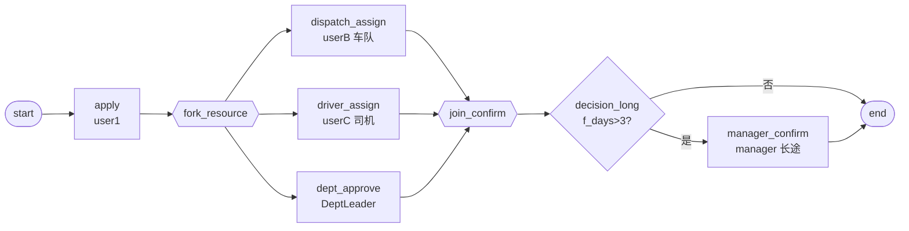

# BDD-用车申请 测试报告

- **测试时间**：2026-09-17 13:56:00（TS=20260917115600）
- **后端**：PG
- **JSON 定义**：`./bdd/bdd-vehicle-request_20260917115600.json`
- **状态**：✅ 2/2 PASS

## 1. 流程定义（Mermaid）

节点数：10（含 start/end），边数：12

## 2. 测试结果

| 测试 | f_days | 路径 | state | 结果 |
|---|---|---|---|---|
| A 短途 | 2 | fork 三方 → join → end | 20 | ✅ |
| B 长途 | 5 | fork 三方 → join → manager → end | 20 | ✅ |

## 3. 复盘

### 3.1 关键技术点

1. **3-fork join**：派车、司机、部门审批 3 个分支并行，全部完成后 join 汇合
2. **decision 嵌套**：join 后判断 f_days 决定是否需要经理确认（长途）
3. **不同 handler 类型混用**：userB/userC 显式 assignee，dept_approve 用 DeptLeader handler

### 3.2 引擎观察

- ✅ fork 三分支并行执行正确
- ✅ join 等所有 doing 完成才流转
- ✅ decision 在 join 后正确路由

### 3.3 改进建议

- 当前无新发现
