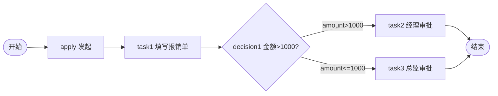

# TDD 03: 决策表达式 decision-expr（PASS）

- **时间**：2026-09-17 15:21:00
- **流程定义**：`./flows/03-decision-expr.json`
- **服务**：main.py（PID 3472967）

## 1. 流程图

注意 task1.assignee=leader（"填写报销单"实际是上级代填）。

## 2. 测试结果

### Case A: amount=2000（>1000 → task2）

| 步骤 | 操作 | 结果 |
|---|---|---|
| 1 | reset + save + deploy | PDID=113 |
| 2 | startAndExecute(amount=2000) | inst=A, apply auto-done |
| 3 | task1.execute(leader) | decision1 → **task2 active (manager)** ✅ |
| 4 | task2.execute(manager) | state=20 ✅ |

### Case B: amount=500（≤1000 → task3）

| 步骤 | 操作 | 结果 |
|---|---|---|
| 1 | startAndExecute(amount=500) | inst=B |
| 2 | task1.execute(leader) | decision1 → **task3 active (director)** ✅ |
| 3 | task3.execute(director) | state=20 ✅ |

## 3. 关键观察

1. **decision expr 正确分支**：`amount > 1000` / `amount <= 1000` 各自匹配对应边
2. **变量传递**：startAndExecute 的 `amount` 字段 + `f_amount` 字段都被 expr 读到（§59 §62 一致）
3. **operator 严格**：必须用对应 actor 执行
4. **task1.assignee='leader'**（"上级代填"语义）— 不是 user1

## 4. 与 AGENTS.md §7 / §47 / §59 对齐

- ✅ `#var` 风格（不是 `#variables.var`）实测可用
- ✅ amount 同时可走 amount 和 f_amount 两个 key
- ✅ task1 执行时 amount 也被 submitTask 顶层变量传递

## 5. 复盘

### 流程设计

- 决策节点 decision1 两条出边：expr 区分金额
- task1 assignee='leader' 表示上级代填报销单
- 流程图设计合理

### 文档改进

无新发现。决策表达式机制已完整记录于 `docs/flow.md §7a` + `docs/known-issues.md §47/§59`。

## 6. 测试报告

- 流程 03 决策表达式：✅ 全通过
- Case A (2000) → manager
- Case B (500) → director
