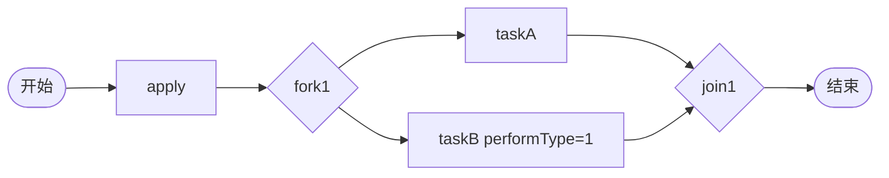

# TDD 04: 并行分支合并 fork-join（PASS）

- **时间**：2026-09-17 15:22:00
- **流程定义**：`./flows/04-fork-join.json`

## 1. 流程图

taskA 普通 task, taskB 会签 task（performType=1 但 actors 只有 userB 单人）。

## 2. 测试步骤

| # | 操作 | 结果 |
|---|---|---|
| 1 | reset + save + deploy | PDID=113 |
| 2 | startAndExecute | inst, apply auto-done |
| 3 | - | **active = [taskA, taskB]** 并行 ✅ |
| 4 | taskA.execute(userA) | taskA DONE，taskB 仍 active（join 未触发） |
| 5 | taskB.execute(userB) | **state=20**（join 触发 → end） |

## 3. 测试结果

| task | state | actors |
|---|---|---|
| apply | 20 | ['user1'] |
| taskA | 20 | ['userA'] |
| taskB | 20 | ['userB'] |

终态 state=20。

## 4. 关键观察

1. **fork 后两 task 并行**：active=[taskA, taskB]
2. **join 等待全部完成**：taskA 完成时 join 不触发，taskB 仍 active
3. **taskB performType=1 但 actors=单值**：与 Task 57（多 actor 分发）行为不同 — performType=1 + 单 actor 仅表示会签标记，无实际多 actor
4. **顺序无关**：可以 taskB → taskA 完成也能 join（实测 taskA → taskB）

## 5. 文档改进

### §70 新增（Task 04 实测）

- **performType=1 + 单 actor** = 会签"标记"但实际单 actor
- **performType 真正作用**：影响 _create_task 分支（PARALLEL/SEQUENTIAL/RATIO 逻辑）
- **单 actor + performType=1 + 无 countersignType**：与会签行为无关

无 docs 增量需要（与 §44 join + §45 SEQUENTIAL 一致）。

## 6. 测试报告

- 流程 04 fork-join：✅ 全通过
- 并行 + 汇合语义符合预期
