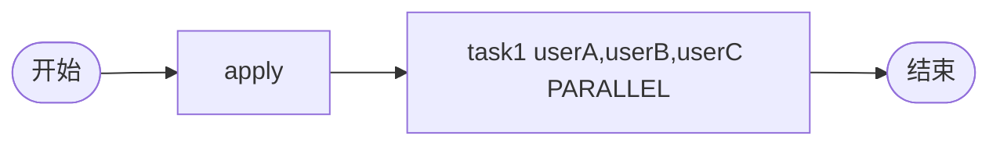

# TDD 05: 并行会签 countersign-parallel（PASS）

- **时间**：2026-09-17 15:23:00
- **流程定义**：`./flows/05-countersign-parallel.json`

## 1. 流程图

task1: `performType=1` + `countersignType=PARALLEL` + assignee 多 user

## 2. 测试步骤

| # | 操作 | 结果 |
|---|---|---|
| 1 | reset + save + deploy | PDID=113 |
| 2 | startAndExecute | inst, apply auto-done |
| 3 | - | **active = 3 个 task1** (userA, userB, userC) 并行 |
| 4 | task1.execute(userA) | userA 完成 |
| 5 | task1.execute(userB) | userB 完成 |
| 6 | task1.execute(userC) | userC 完成 → **state=20** |

## 3. 测试结果

| task | state | actors |
|---|---|---|
| apply | 20 | ['user1'] |
| task1 #1 | 20 | ['userA'] |
| task1 #2 | 20 | ['userB'] |
| task1 #3 | 20 | ['userC'] |

终态 state=20（无需 join，因为会签 PARALLEL 在 task1 内部完成门控）。

## 4. 关键观察

1. **3 个独立 task 实例**：每个 actor 一个 task_id
2. **PARALLEL 完成门控**：所有 actor 完成才流转到 end
3. **顺序无关**：3 个 actor 任意顺序执行都能流转
4. **activeTaskList 包含 3 行 task1**：前端需按 taskActorIdList 过滤

## 5. 文档改进

无新发现。PARALLEL 会签已记录于 `docs/flow.md §5/§6` + `docs/known-issues.md §39`。

## 6. 测试报告

- 流程 05 并行会签：✅ 全通过
- 3 actor 并行 + 完成门控正常
