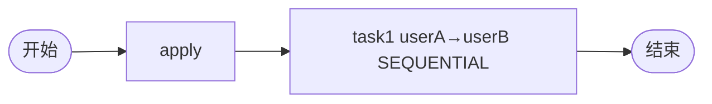

# TDD 06: 串行会签 countersign-sequential（PASS）

- **时间**：2026-09-17 15:24:00
- **流程定义**：`./flows/06-countersign-sequential.json`

## 1. 流程图

task1: `performType=1` + `countersignType=SEQUENTIAL` + assignee=`userA,userB`

## 2. 测试步骤

| # | 操作 | 结果 |
|---|---|---|
| 1 | reset + save + deploy | PDID=113 |
| 2 | startAndExecute | inst, apply auto-done |
| 3 | - | active = [task1 #1 actor=userA]（仅第一个） |
| 4 | task1.execute(userA) | **task1 #2 active (userB)** ✅ |
| 5 | task1.execute(userB) | **state=20** ✅ |

## 3. 测试结果

| task | state | actors |
|---|---|---|
| apply | 20 | ['user1'] |
| task1 #1 | 20 | ['userA'] |
| task1 #2 | 20 | ['userB'] |

终态 state=20。

## 4. 关键观察

1. **SEQUENTIAL 顺序推进**：仅第一个 actor 任务 DOING，其他 PENDING
2. **完成当前 → 创建下一个**：userA 完成 → 自动创建 userB task
3. **PENDING task 不在 activeTaskList**（§45 一致）
4. **无需 join 节点**：SEQUENTIAL 完成最后一个 actor 才流转到 end

## 5. 文档改进

无新发现。SEQUENTIAL 机制已记录于 `docs/flow.md §5/§6` + `docs/known-issues.md §45`。

## 6. 测试报告

- 流程 06 串行会签：✅ 全通过
- 2 actor 顺序执行 → 流转 end
