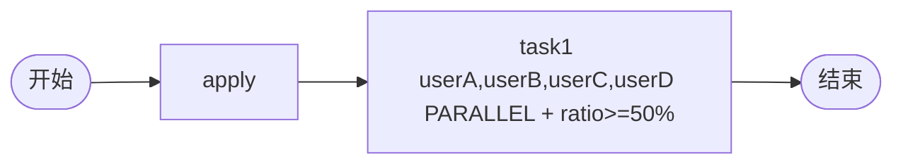

# TDD 07: 比例会签 countersign-ratio（PASS）

- **时间**：2026-09-17 15:25:00
- **流程定义**：`./flows/07-countersign-ratio.json`

## 1. 流程图

task1:
- `performType=1`
- `countersignType=PARALLEL`
- `countersignCompletionCondition: "#nrOfCompletedInstances==2"`（在 field 子节点）
- assignee=4 人

## 2. 测试步骤

| # | 操作 | 结果 |
|---|---|---|
| 1 | reset + save + deploy | PDID=113 |
| 2 | startAndExecute | inst, apply auto-done |
| 3 | - | active = [task1×4] 4 个并行 |
| 4 | task1.execute(userA) | 1/2 完成 |
| 5 | task1.execute(userB) | **2/2 达到 → state=20** ✅ |

## 3. 测试结果

| task | state | actors | 说明 |
|---|---|---|---|
| apply | 20 | ['user1'] | 启动 |
| task1 #1 (userA) | 20 | ['userA'] | 完成 |
| task1 #2 (userB) | 20 | ['userB'] | 完成 |
| task1 #3 (userC) | **99** | ['userC'] | ABANDONED（未达） |
| task1 #4 (userD) | **99** | ['userD'] | ABANDONED（未达） |

终态 state=20。

## 4. 关键观察

1. **比例门控生效**：完成 2 个 = 达 50% → 流转 end
2. **未完成 task ABANDONED**：state=99（§39 一致）
3. **countersignCompletionCondition 在 field 子节点**：Java 兼容格式
4. **OGNL `#nrOfCompletedInstances==2`**：引擎自动注入计数变量
5. **2 个完成即可**：无需全部 4 个完成

## 5. 文档改进

无新发现。比例会签已记录于 `docs/flow.md §5` + `docs/known-issues.md §39`。

## 6. 测试报告

- 流程 07 比例会签：✅ 全通过
- 4 actor → 2 完成即流转 → state=20
- ABANDONED state=99 正常处理
