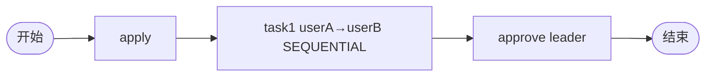

# TDD 08: 串行会签后并联 approve countersign-sequential-approve（PASS）

- **时间**：2026-09-17 15:26:00
- **流程定义**：`./flows/08-countersign-sequential-approve.json`

## 1. 流程图

会签 + 后置审批节点组合。

## 2. 测试步骤

| # | 操作 | active | state |
|---|---|---|---|
| 1 | startAndExecute | [task1 userA] | 10 |
| 2 | task1.execute(userA) | [task1 userB] | 10 |
| 3 | task1.execute(userB) | [approve leader] | 10 |
| 4 | approve.execute(leader) | [] | **20** ✅ |

## 3. 测试结果

| task | state | actors |
|---|---|---|
| apply | 20 | ['user1'] |
| task1 #1 (userA) | 20 | ['userA'] |
| task1 #2 (userB) | 20 | ['userB'] |
| approve | 20 | ['leader'] |

终态 state=20。

## 4. 关键观察

1. **SEQUENTIAL + 后续 task**：task1 完成后流转到 approve
2. **复合流程**：会签链 + 普通审批节点
3. **无 join 节点**：SEQUENTIAL 完成最后 actor → 流转
4. **状态机累积**：4 个 task 记录完整

## 5. 文档改进

无新发现。会签 + 后续 task 是标准组合。

## 6. 测试报告

- 流程 08 复合：✅ 全通过
