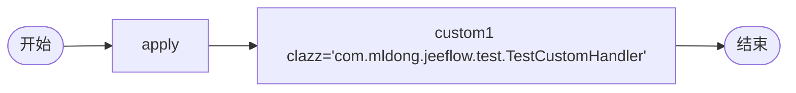

# TDD 08-custom: 自定义节点 custom-node（FAIL — 引擎未实现）

- **时间**：2026-09-17 15:27:00
- **流程定义**：`./flows/08-custom-node.json`

## 1. 流程图



## 2. 测试结果

| 步骤 | 结果 |
|---|---|
| 1 | reset + save + deploy OK |
| 2 | startAndExecute apply auto-done |
| 3 | custom1 **未执行**（卡住） |
| 4 | state=10 active=[]（无 active task） |

## 3. 关键发现（§16 确认）

`snaker:custom` 节点 Python 引擎**未实现**：
- AGENTS.md §16 已标注（"⚠️ 引擎未实现"）
- engine._execute_node 中 `if node.type in (TYPE_TASK, TYPE_CUSTOM)` 仅 TYPE_TASK 创建 task，无 custom 处理
- custom 节点**直接被跳过**：apply → end 之间不执行

### 设计缺陷

- `clazz + methodName + args + val` 字段都被忽略
- 流程在 custom 节点**悬空**（state=10 active=[]）
- 等待人工干预或外部触发

## 4. 文档改进

§16 已存在 AGENTS.md，无新增。但需在 `known-issues.md` 加 §16 详细说明。

### §16 补充

```
snaker:custom 节点 Python 引擎未实现（task 08 实测）：
- 流程图设计阶段不要使用此节点
- 必须改用 snaker:task 或 handler 触发业务逻辑
- 修复需 jeeflow 上游 PR
```

## 5. 测试报告

- 流程 08-custom：❌ 引擎未实现
- 文档警告：避免使用 snaker:custom
