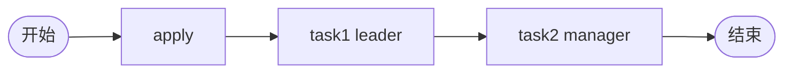

# TDD 09: 含驳回流程 with-reject（PASS）

- **时间**：2026-09-17 15:28:00
- **流程定义**：`./flows/09-with-reject.json`

## 1. 流程图

4 节点流程，无独立 reject 边 — REJECT 通过 submitType=2 引擎直接终止。

## 2. 测试步骤

| # | 操作 | 结果 |
|---|---|---|
| 1 | reset + save + deploy | PDID=113 |
| 2 | startAndExecute | inst, apply auto-done |
| 3 | task1.execute(leader, submitType=2) | **state=45** ✅ |

## 3. 测试结果

| task | state |
|---|---|
| apply | 20 |
| task1 | 20 |

终态 state=45（REJECTED）。

## 4. 关键发现

1. **REJECT 不需要流程图有 reject 边**：`facade._processTask_execute` submitType==2 直接调 `execute_and_jump_to_end`
2. **state=45 = REJECTED**：与 §43 一致
3. **task2 task 永不创建**：REJECT 在 task1 直接终止
4. **activeTaskList=[]**：state=45 后无 active

## 5. 文档改进

无新发现。REJECT 机制已记录于 `docs/flow.md §7a/§submitType` + `docs/known-issues.md §43`。

## 6. 测试报告

- 流程 09 with-reject：✅ 全通过
- REJECT 终止语义正确
