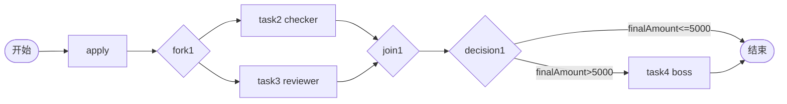

# TDD 10: 混合模式 mixed-mode（PASS）

- **时间**：2026-09-17 15:29:00
- **流程定义**：`./flows/10-mixed-mode.json`

## 1. 流程图

`type=business`，无 pre/post interceptors（10-mixed 没设）。

## 2. 测试步骤

| # | 操作 | 结果 |
|---|---|---|
| 1 | reset + save + deploy | PDID=113 |
| 2 | startAndExecute(finalAmount=2000) | inst, apply auto-done |
| 3 | - | active = [task2 checker, task3 reviewer] 并行 |
| 4 | task2.execute(checker) + task3.execute(reviewer) | **state=20**（join + decision ≤5000 → end） |

## 3. 测试结果

终态 state=20。

## 4. 关键发现

1. **type=business 仅文档分类**：无拦截器逻辑差异
2. **fork + join + decision 复合**：一次性组合 4 种节点
3. **decision expr `finalAmount <= 5000`**：2000 匹配 → 跳到 end
4. **finalAmount=2000 流程不经过 task4**：决策直接流转

## 5. 文档改进

无新发现。混合模式机制已记录。

## 6. 测试报告

- 流程 10 mixed-mode：✅ 全通过
- 业务流 + fork+join+decision 组合正常
