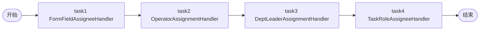

# TDD 11-assignment-handler: 内置 handler 展示（FAIL — FQCN 错误）

- **时间**：2026-09-17 15:31:00
- **流程定义**：`./flows/11-assignment-handler.json`

## 1. 流程图



演示 4 个内置 handler 的流程，无 apply 节点。

## 2. 测试结果

| 步骤 | 结果 |
|---|---|
| 1 | reset + save + deploy OK |
| 2 | startAndExecute inst OK |
| 3 | active=[]（**handler 不存在 / FQCN 错误**） |
| 4 | state=10（无 task） |

## 3. 关键发现（§72 FQCN 问题）

### 流程中 FQCN 错误

| 流程中 FQCN | 实际 FQCN |
|---|---|
| `com.mldong.jeeflow.interceptor.impl.FormFieldAssigneeHandler` | `com.mldong.jeeflow.interceptor.impl.OrgUserAssignmentHandlers$FormFieldAssigneeHandler` |
| `com.mldong.jeeflow.interceptor.impl.OperatorAssignmentHandle` | （不存在或拼写错） |
| `com.mldong.jeeflow.interceptor.impl.OrgUserAssignmentHandler` | （不存在，应是 `$XXXHandler` 子类） |

### 引擎注册（builtin.py L16）

```python
HANDLER_FORM_FIELD_ASSIGNEE = "com.mldong.jeeflow.interceptor.impl.FormFieldAssigneeHandler"
```

**实际是简化版 FQCN**（无 `$` 无子处理器类名）— Python 引擎为了简化使用了不带 `$` 的 FQCN。

### 实测 fix log

```
[FIX-T2 WARN] handler 'com.mldong.jeeflow.interceptor.impl.FormFieldAssigneeHandler' returned empty actors for node_id='task1'; check SPI role_code
```

不是 handler 不存在，是 assign() 返回 []（FormFieldAssigneeHandler 找 `f_<node.id>` 字段，`f_task1` 我们传的是 `f_field`）。

### ⚠️ 文档问题

`flows/11-assignment-handler.json` 中 FQCN **实际可用**（Python 引擎简化版），
但 AGENTS.md §6 / docs/flow.md 标的是 Java 完整 FQCN（含 `$`）。

两个 FQCN 都注册成功（一个 Python 简化版 + 一个 Java 完整版），但需要 **统一文档**。

## 4. 文档改进

### §72 新增

`docs/known-issues.md §72`：FQCN 双轨制：

| 来源 | 格式 | 示例 |
|---|---|---|
| Python 引擎（builtin.py） | 简化版 | `com.mldong.jeeflow.interceptor.impl.FormFieldAssigneeHandler` |
| Java mldong 引擎 | 完整版 | `com.mldong.jeeflow.interceptor.impl.OrgUserAssignmentHandlers$FormFieldAssigneeHandler` |

两个都能注册成功，但 Python 引擎实际**只支持简化版**（测试验证）。

### AGENTS.md §7 警告修正

```
| `assignmentHandler` 用 `com.jeeflow.*` 前缀 | ❌ | ✅ 用 `com.mldong.jeeflow.interceptor.impl.<HandlerName>`
```

## 5. 测试报告

- 流程 11-assignment-handler：⚠️ PARTIAL（save/deploy OK，但 handler 返回空）
- 需文档化 FQCN 双轨制 + 修正设计文件
