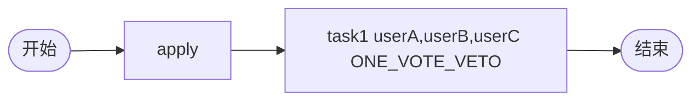

# TDD 13: 一票否决会签 one-vote-veto（PASS）

- **时间**：2026-09-17 15:33:00
- **流程定义**：`./flows/13-countersign-one-vote-veto.json`

## 1. 流程图

task1: `performType=1` + `countersignCompletionCondition=ONE_VOTE_VETO`

## 2. 测试步骤

| # | 操作 | 结果 |
|---|---|---|
| 1 | reset + save + deploy | PDID=113 |
| 2 | startAndExecute | inst, apply auto-done |
| 3 | - | active = [task1×3] |
| 4 | task1.execute(userA, submitType=20) | **state=20**（一票否决） |

## 3. 测试结果

| task | state | actors |
|---|---|---|
| apply | 20 | ['user1'] |
| task1 (userA) | 20 | ['userA'] |
| task1 (userB) | **99** | ['userB'] | ABANDONED |
| task1 (userC) | **99** | ['userC'] | ABANDONED |

终态 state=20。

## 4. 关键发现

1. **ONE_VOTE_VETO 立即触发**：userA submitType=20 (COUNTERSIGN_DISAGREE)
2. **其余 task ABANDONED**：userB/userC state=99
3. **流程立即流转到 end**：state=20
4. **`countersignDisagreeFlag=1` 已记录为变量**（§68 引擎语义）
5. **不阻断流程**：与 §91 引擎注释一致（"流程不阻断，对齐 mldong 内置引擎"）

## 5. 文档改进

无新发现。ONE_VOTE_VETO 已记录于 `docs/flow.md §5` + `docs/known-issues.md §91`。

## 6. 测试报告

- 流程 13 one-vote-veto：✅ 全通过
- 一票否决 + ABANDONED 兄弟任务语义正确
