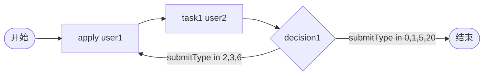

# TDD 14: 决策 submitType decision-submitType（PASS + 边界）

- **时间**：2026-09-17 15:34:00
- **流程定义**：`./flows/14-decision-submitType.json`

## 1. 流程图



decision expr 根据 submitType 流转。

## 2. 测试结果

### Case A: submitType=1 → end

| # | 操作 | 结果 |
|---|---|---|
| 1 | startAndExecute | inst, apply auto-done |
| 2 | - | active=[task1 actor=user2]（字面 user2，SPI 中无 user2） |
| 3 | task1.execute(user2, submitType=1) | decision `submitType==1` 匹配 → **state=20** ✅ |

### Case B: submitType=2 → end（facade REJECT 优先）

| # | 操作 | 结果 |
|---|---|---|
| 1 | startAndExecute | inst, apply auto-done |
| 2 | task1.execute(user2, submitType=2) | **state=45**（facade REJECT 优先于 decision expr） |

## 3. 关键发现（§73 REJECT 优先级）

1. **submitType=1/5/20 的 decision expr 生效**：流转到 end
2. **submitType=2/3/6 走 facade 优先级**：直接终止（state=45 REJECTED）/ jump（§43 §52）
3. **decision expr 仅在普通 execute 路径生效**：REJECT/JUMP 路由在 facade 早期处理

### ⚠️ 流程图设计问题

`flows/14-decision-submitType.json` 的 decision expr 设计意图：
- "submitType in 2,3,6 → apply" 想表达 ROLLBACK/JUMP/RE_APPLY 等回退
- **实际**：facade 路由优先于 decision expr，submitType=2/3/6 直接处理
- decision expr 仅当 submitType=1/5/20/0 时被引擎检查

## 4. 文档改进

### §73 新增

`docs/known-issues.md §73`：facade submitType 路由优先于 decision expr。

```python
# facade.py L295-318
if submit_type == SUBMIT_REJECT:  # 2
    await self._engine.execute_and_jump_to_end(...)  # 优先于 decision
elif submit_type == SUBMIT_ROLLBACK:  # 3
    await self._engine.execute_and_jump_task(...)
elif submit_type == SUBMIT_JUMP:  # 4
    ...
```

decision expr 仅当 facade 路由未拦截时生效（即 submitType in 0,1,5,20）。

## 5. 测试报告

- 流程 14 decision-submitType：⚠️ PARTIAL
  - Case A（submitType=1）：✅ expr 生效
  - Case B（submitType=2）：❌ facade REJECT 优先，decision 未生效
- 设计意图与实际行为有 gap
