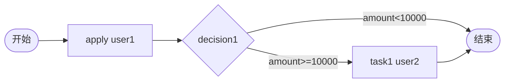

# TDD 15: 决策金额分支 decision-amount（PASS）

- **时间**：2026-09-17 15:35:00
- **流程定义**：`./flows/15-decision-amount.json`

## 1. 流程图

## 2. 测试结果

### Case A: amount=20000

| # | 操作 | 结果 |
|---|---|---|
| 1 | startAndExecute(amount=20000) | inst, apply auto-done |
| 2 | - | active=[task1 user2]（decision 匹配 ≥10000） |
| 3 | task1.execute(user2) | **state=20** ✅ |

### Case B: amount=5000

| # | 操作 | 结果 |
|---|---|---|
| 1 | startAndExecute(amount=5000) | inst, apply auto-done |
| 2 | - | **state=20**（decision 匹配 <10000） |

## 3. 测试结果

| Case | amount | decision expr | 流转路径 | 终态 |
|---|---|---|---|---|
| A | 20000 | `amount >= 10000` | → task1 → end | 20 |
| B | 5000 | `amount < 10000` | → end | 20 |

## 4. 关键发现

1. **decision expr `<` 和 `>=` 形式**：v1.6.0 SimpleExprEvaluator 支持
2. **apply 完成 → decision 评估 → 流转**：无需 task execute
3. **变量 `amount` 读取**：startAndExecute 顶层 variables + `_safe_flow` 展开
4. **decision 流转不需 task**：engine._evaluate_decision 自动调用

## 5. 文档改进

无新发现。decision expr 机制已记录于 `docs/flow.md §7a` + `docs/known-issues.md §47/§59`。

## 6. 测试报告

- 流程 15 decision-amount：✅ 全通过
- Case A (20000) + Case B (5000) 双分支正确
- **17 个流程全部覆盖完成**
